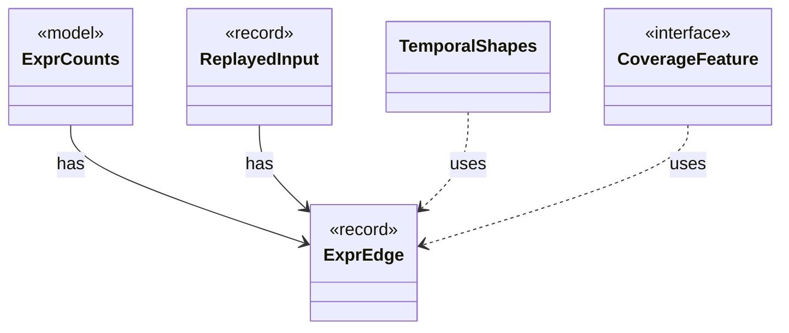

# `ExprEdge`

`io.github.tlaplus.hardening.common` · record · other · [source](https://github.com/tlaplus/model-checker-hardening/blob/d5dcbcb332600c9312f00550a0131fd51a164e9f/src/main/java/io/github/tlaplus/hardening/common/ExprEdge.java#L12) · module [common](../modules/common.md)

An edge of an expression tree between two constructs: `parent` applied to, or binding, an immediate subexpression that is the construct `child`.

**Decisions:** [ADR 0028: Temporal properties that read the state](https://github.com/tlaplus/model-checker-hardening/blob/d5dcbcb332600c9312f00550a0131fd51a164e9f/docs/decisions/0028-temporal-property-quality.md)

```mermaid
classDiagram
  class ExprEdge {
    <<record>>
  }
  class ExprCounts {
    <<model>>
  }
  class ReplayedInput {
    <<record>>
  }
  class TemporalShapes
  class CoverageFeature {
    <<interface>>
  }
  ExprCounts --> ExprEdge : has
  ReplayedInput --> ExprEdge : has
  TemporalShapes ..> ExprEdge : uses
  CoverageFeature ..> ExprEdge : uses
```

The diagram draws 4 of 6 relations; the table lists them all.

| Direction | Relation | Type | Summary |
|---|---|---|---|
| ← | has | [ExprCounts](io.github.tlaplus.hardening.common.ExprCounts.md) | The size of a piece of TLA+ code, the occurrences of each expression construct in it, and the occurrences of each edge between constructs. |
| ← | has | [ReplayedInput](io.github.tlaplus.hardening.corpus.ReplayedInput.md) | What replaying one stored input shows beyond its envelope. |
| ← | uses | [TemporalShapes](io.github.tlaplus.hardening.signature.TemporalShapes.md) | Counts the temporal shapes of a module's properties (ADR 0028 §2). |
| ← | uses | [CoverageFeature](io.github.tlaplus.hardening.workflow.quality.CoverageFeature.md) | One coverage feature of an entry, with the hit-count bucket of its occurrences: a construct or an edge between constructs of its evaluated code (ADR 0013), or a temporal shape of its property (ADR 0028 §3). |
| ← | depends | [EntryRows](io.github.tlaplus.hardening.database.EntryRows.md) | The rows that one decoded corpus entry contributes: its `entry` row, followed by the rows that reference it: one `knownDefect` row per signature, one `mutationOperator` row per operator, one `stage` row per stage record, one `expr` row per expression construct of its replayed input and one `exprEdge` row per edge between constructs. |
| ← | depends | [IrExprCounts](io.github.tlaplus.hardening.signature.IrExprCounts.md) | Counts the size and constructs of the code the tools evaluate, over the walk that signatures match against. |
