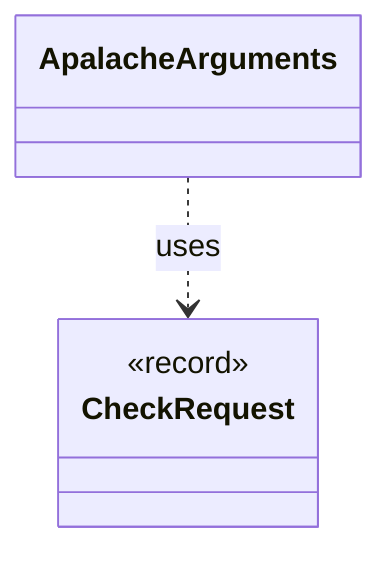

# `ApalacheArguments`

`io.github.tlaplus.hardening.workflow.apalache` · class · other · [source](https://github.com/tlaplus/model-checker-hardening/blob/0434b0d13c245aeb0f8ca5e7f7b4f69467daa2da/src/main/java/io/github/tlaplus/hardening/workflow/apalache/ApalacheArguments.java#L10) · module [workflow](../modules/workflow.md)

The Apalache command line for one checked module.

```mermaid
classDiagram
  class ApalacheArguments
  class CheckRequest {
    <<record>>
  }
  ApalacheArguments ..> CheckRequest : uses
```

The diagram draws 1 of 4 relations; the table lists them all.

| Direction | Relation | Type | Summary |
|---|---|---|---|
| → | uses | [CheckRequest](io.github.tlaplus.hardening.workflow.worker.CheckRequest.md) | What a checker is asked about one assembled module. |
| → | depends | [FuzzInputModule](io.github.tlaplus.hardening.workflow.spec.FuzzInputModule.md) | Assembles the module checked by the parser and model-checker stages. |
| → | depends | [CheckKind](io.github.tlaplus.hardening.workflow.worker.CheckKind.md) | What one checker invocation checks in an assembled module: which side's specification it explores, and whether it checks the invariant, the action invariant of a metamorphic module and a temporal property. |
| ← | depends | [ApalacheWorkerMain](io.github.tlaplus.hardening.workflow.apalache.ApalacheWorkerMain.md) | Persistent child process that invokes Apalache's `Tool.run` sequentially. |
