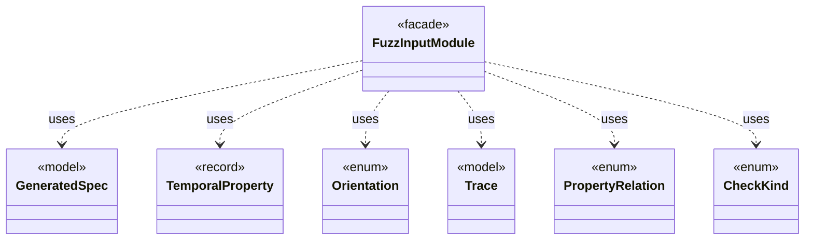

# `FuzzInputModule`

`io.github.tlaplus.hardening.workflow.spec` · class · facade · key · [source](https://github.com/tlaplus/model-checker-hardening/blob/b1d642d707df18a7597ce87d7e826c837e78f842/src/main/java/io/github/tlaplus/hardening/workflow/spec/FuzzInputModule.java#L47) · module [workflow](../modules/workflow.md)

Assembles the module checked by the parser and model-checker stages.

```mermaid
classDiagram
  class FuzzInputModule {
    <<facade>>
  }
  class GeneratedSpec {
    <<model>>
  }
  class TemporalProperty {
    <<record>>
  }
  class Orientation {
    <<enum>>
  }
  class Trace {
    <<model>>
  }
  class PropertyRelation {
    <<enum>>
  }
  class CheckKind {
    <<enum>>
  }
  FuzzInputModule ..> GeneratedSpec : uses
  FuzzInputModule ..> TemporalProperty : uses
  FuzzInputModule ..> Orientation : uses
  FuzzInputModule ..> Trace : uses
  FuzzInputModule ..> PropertyRelation : uses
  FuzzInputModule ..> CheckKind : uses
```

The diagram draws 6 of 24 relations; the table lists them all.

| Direction | Relation | Type | Summary |
|---|---|---|---|
| → | uses | [GeneratedSpec](io.github.tlaplus.hardening.gen.GeneratedSpec.md) | The declarations one generated module consists of. |
| → | uses | [TemporalProperty](io.github.tlaplus.hardening.gen.TemporalProperty.md) | The temporal property of a generated module and the fairness that constrains it. |
| → | uses | [Orientation](io.github.tlaplus.hardening.gen.rewrite.Orientation.md) | Which side of a metamorphic pair the checker explores (ADR 0016 §3). |
| → | uses | [Trace](io.github.tlaplus.hardening.gen.trace.Trace.md) | The states of one recorded counterexample and what its last state claims (ADR 0034 §1, §2). |
| → | uses | [PropertyRelation](io.github.tlaplus.hardening.workflow.spec.PropertyRelation.md) | How the relation module of a metamorphic pair of modules treats their properties and fairness. |
| → | uses | [CheckKind](io.github.tlaplus.hardening.workflow.worker.CheckKind.md) | What one checker invocation checks in an assembled module: which side's specification it explores, and whether it checks the invariant, the action invariant of a metamorphic module and a temporal property. |
| → | depends | [GeneratedOperator](io.github.tlaplus.hardening.gen.GeneratedOperator.md) | A generated definition, stored once in module declaration order. |
| → | depends | [InputRejectedException](io.github.tlaplus.hardening.gen.InputRejectedException.md) | Indicates that the current input cannot be decoded into a valid value. |
| → | depends | [IrNames](io.github.tlaplus.hardening.gen.ir.IrNames.md) | Names in typed IR: injective renaming and the names an expression reads from its context. |
| → | depends | [TraceEnding](io.github.tlaplus.hardening.gen.trace.TraceEnding.md) | What the last state of a recorded trace claims (ADR 0034 §1), which decides what its replay checks there. |
| → | depends | [TraceLiterals](io.github.tlaplus.hardening.gen.trace.TraceLiterals.md) | Builds the typed IR literal of a recorded value (ADR 0034 §3). |
| ← | depends | [DecodedInputRenderer](io.github.tlaplus.hardening.cli.DecodedInputRenderer.md) | Renders a decoded input independently of picocli command wiring. |
| ← | depends | [ApalacheArguments](io.github.tlaplus.hardening.workflow.apalache.ApalacheArguments.md) | The Apalache command line for one checked module. |
| ← | depends | [ApalacheWorkerMain](io.github.tlaplus.hardening.workflow.apalache.ApalacheWorkerMain.md) | Persistent child process that invokes Apalache's `Tool.run` sequentially. |
| ← | depends | [GenericConvention](io.github.tlaplus.hardening.workflow.generic.GenericConvention.md) | What a compatibility means to the generic checker (ADR 0033 §2): the configuration file written as `{config}`, how an exit status becomes a verdict, and which exploration metrics the tool's output gives (§5). |
| ← | depends | [GenericInvocation](io.github.tlaplus.hardening.workflow.generic.GenericInvocation.md) | The files and the command line of one generic checker invocation in its working directory (ADR 0033 §3, §4). |
| ← | depends | [ParserWorkerMain](io.github.tlaplus.hardening.workflow.parser.ParserWorkerMain.md) | Child-process entry point for persistent isolated SANY requests. |
| ← | depends | [EvaluatedExprs](io.github.tlaplus.hardening.workflow.spec.EvaluatedExprs.md) | Replays a stored input and counts the expression constructs of the code the checkers evaluate: the definitions reachable from `SpecArtifact.entryPoints`. |
| ← | depends | [PropertyRelation](io.github.tlaplus.hardening.workflow.spec.PropertyRelation.md) | How the relation module of a metamorphic pair of modules treats their properties and fairness. |
| ← | depends | [SpecArtifact](io.github.tlaplus.hardening.workflow.spec.SpecArtifact.md) | One assembled module, what its checkers are asked about it, and what its decoder produced. |
| ← | depends | [TlcConfiguration](io.github.tlaplus.hardening.workflow.tlc.TlcConfiguration.md) | The TLC configuration file for one checked module. |
| ← | depends | [TlcTraceRecorder](io.github.tlaplus.hardening.workflow.tlc.TlcTraceRecorder.md) | Records the counterexample TLC prints (ADR 0034 §5), as the JSON a worker returns: its states in the Informal Trace Format and what its last state claims. |
| ← | depends | [TlcWorkerMain](io.github.tlaplus.hardening.workflow.tlc.TlcWorkerMain.md) | One-shot TLC child process. |
| ← | depends | [PropertyRunsVerdict](io.github.tlaplus.hardening.workflow.tool.PropertyRunsVerdict.md) | Folds the relation run of a metamorphic module and its two property runs into the one outcome of a checker stage (ADR 0027 §4, ADR 0029 §1). |
