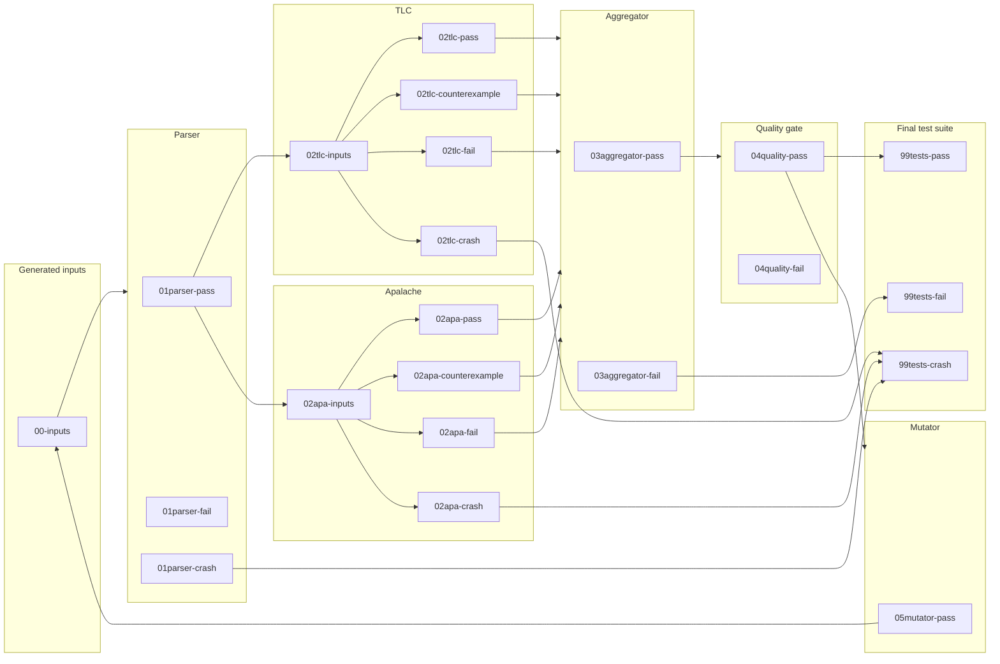

# General fuzzing workflows

**Author:** Igor Konnov

This document captures our approach to generating high-quality TLA<sup>+</sup>
specifications. We call this process "fuzzing" in general, independently of whether we are using random generators (in
the spirit of property-based testing), or using genetic algorithms with coverage feedback (in the spirit of AFL and
cargofuzz).

## 1. Processing pipeline

The input-generation, parser, TLC, Apalache, and conformance-aggregator stages
described below are implemented. The quality gate, mutator, and final test-suite
stages remain proposals. [ADR 0001][] records the stage and worker execution
model. [ADR 0002][] records the property-based input admission policy.
[ADR 0005][] records the separate model-checker counterexample verdict.

### 1.1. General architecture

Our fuzzing workflows follows the general architecture that is shown in the figure below. In certain workflows, some of
the stages may be missing. In the future, we may add additional stages. Nevertheless, we believe that this architecture
is general enough to encompass many fuzzing frameworks.

The implemented input stage uses stratified rejection sampling to prevent empty
collection literals from dominating the corpus. For each target entry, it selects
one collection-richness cohort uniformly and retains that cohort until it admits a
unique input. Each generator worker has deterministic, independent candidate and
cohort streams derived from the run seed. Workers claim target entries
dynamically. This policy belongs to the workflow; the IR decoders remain
deterministic mappings from bytes to IR. The richness score covers the
expressions an input decoded to, each counted once, rather than the assembled
module: the module also holds the fixed skeleton, and the expression wrapper
repeats its one expression in two definitions, so scoring the module would make
a stored score depend on the skeleton rather than on the input. Admission also
rejects a candidate whose assembled module renders to more TLA<sup>+</sup> source
than one worker request frame holds, so no stored entry can only be crashed on by
the parser and TLC.

Every tool stage regenerates the same closed, typed IR from the stored bytes and
the invocation's immutable prepared operator library.
Which decoder it uses is a property of the entry rather than of the run: the
envelope's `kind` field names it, `workflow.spec.SpecDecoders` pairs each kind
with its decoder, and `generator.kind` selects only what a run *generates*, so a
corpus may hold entries of more than one kind. An `expr` entry is wrapped in the
fixed single-state module; a `module` entry decodes to a whole module's
declarations. Either way the stage receives one assembled module and the
exploration depth it asks for.

The parser and TLC consume a TLA+ module rendered with
`PrettyWriterWithAnnotations`. Apalache instead consumes its typed IR JSON
format, which preserves the type tag on every expression and avoids inferring
types again from lossy source syntax. The pinned Apalache JSON reader cannot
decode `LABEL`; the Apalache renderer therefore replaces each label with its
first operand before serialization. Labels are semantically transparent to the
model checker, and the parser and TLC retain the original labeled expression.
This normalization is temporary; [the JSON label finding][] tracks its removal.

In the figure below, the outer boxes are the stages of the pipeline, while the inner boxes are directories in the
corpus. The names of the directories reflect the status of each input within the stage.



### 1.2. Custom-operator preparation

**Implemented architectural extension.** Before constructing decoders, the workflow
prepares the modules selected by `generator.custom_operators`. `generator.classpath`
is an ordered list of directories or JARs; paths read from TOML are resolved against
that file's directory. Directory roots and JAR root resources contain `Module.tla`;
JARs may also use `tla2sany/StandardModules/Module.tla`. First occurrence wins.
Bundled standard module names cannot be overridden. JARs supply source resources,
not executable Java operator overrides.

`workflow.library.LibrarySources` copies the source search path into a private
snapshot, bounded to 32 MiB. The snapshot includes unselected source files so SANY
can resolve transitive `EXTENDS` and `INSTANCE` dependencies without a second,
ad-hoc dependency parser. SANY in the pinned Apalache distribution performs the
actual module lookup. The entire source snapshot, including unused files, belongs
to the replay identity.

`LibraryTypechecker` invokes that distribution as an isolated CLI process:
`typecheck --infer-poly=true --output=<module.json> <module.tla>`. It runs once per
configured root module, not per candidate or stage. It uses a private working
directory, explicit Apalache configuration and row typing, bounded diagnostics,
and the Apalache stage's heap and timeout settings. Cancellation interrupts the
wait and terminates the child; it does not poll the process. All scratch files are
removed on completion or failure. No Maven importer/typechecker dependency is
introduced. With no selected modules, preparation does not inspect paths or launch
a process.

The direct typed-IR JSON reader loads output of at most 64 MiB. The builder-backed
reader is deliberately not used: in the pinned dependency it incorrectly
reconstructs a polymorphic empty set as a set of sets. Library validation then
checks supported types, dependency closure, first-order signatures and state-free
syntax. Preparation errors stop the invocation; they are not input rejections or
checker-stage verdicts.

`SpecDecoders` captures the prepared library for both input kinds. `OperatorLibrary`
links each used definition closure into the assembled module with fresh IR
identities. TLA+ and Apalache JSON outputs are self-contained and require no custom
classpath in checker workers. Standalone expression printing uses a surrounding
`LET`; richness scoring retains the unlinked generated expressions.

The first custom-library run records `.operator-library` atomically under the
corpus lock, before admitting inputs. It contains the ordered export selection,
source filenames and SHA-256 digests, and the pinned Apalache JAR digest. Subsequent
runs and `print --corpus` require an exact match. Paths may move without changing
identity. A missing manifest cannot be initialized over existing inputs, and
read-only printing never creates one. Removing the custom library from the config
also fails verification if a manifest exists. To change a library, initialize a
new corpus. Storage reads and writes opaque bytes; this validation policy belongs
to the workflow.

### 1.3. Conformance testing of TLC vs. Apalache with random inputs

In this workflow, the goal is to collect a differential testing suite. This test suite contains three kinds of test
inputs:

- **Positive tests.** These specifications show that TLC and Apalache report the
  same non-crash verdict.
- **Negative tests.** These specifications show that TLC and Apalache report
  different non-crash verdicts. In particular, they preserve cases in which
  exactly one checker produces a counterexample.
- **Crash tests.** One of the model checkers crashes on the input.

This workflow specializes the general workflow as follows:

- **Aggregator.** At this stage, the input is moved to `pass` when TLC and Apalache
  report the same non-crash verdict: pass/pass, counterexample/counterexample, or
  fail/fail. Any verdict disagreement moves to `fail`. In particular, a
  counterexample from exactly one checker is a conformance failure, including
  counterexample/fail: an ordinary checker failure does not claim that the
  invariant was violated. Failure codes are diagnostic metadata and do not affect
  this verdict-level comparison. A crash in either checker is not aggregated and
  remains in the checker result directories.
- **Mutator.** The mutator is no-operation. It does not generate new inputs.
- **Quality gate.** Good quality gates are to be found.

### 1.4. Metamorphic testing of TLC and Apalache

In this workflow, the goal is to collect a metamorphic test suite. This test suite contains two kinds of test inputs:

- **Positive tests.** These tests demonstrate that the model checker preserves equivalent transformations, as expected.
- **Negative tests.** These tests demonstrate soundness issues in the model checker. They present two equivalent
  expressions that are not equal in the model checker's interpretation.
- **Crash tests.** The model checker crashes on the input.

This workflow specializes the general workflow as follows:

- **Aggregator.** At this stage, the input is move to `pass`, when both TLC and Apalache pass.
- **Mutator.** The mutator applies equivalent transformations to some operators of the specification that corresponds to
  the input.
- **Quality gate.** Good quality gates are to be found.

### 1.5. Coverage-based fuzzing

In this workflow, the goal is to generate a test suite that produces a high coverage of the model checker's source code.
This test suite contains one kind of test inputs:

- **Positive tests.** These tests do not fail the model checker and increase the source code coverage of the model
  checker.
- **Crash tests.** The model checker crashes on the input.

It is not clear to us, what kind of negative tests we can produce in this case.

This workflow specializes the general workflow as follows:

- **Aggregator.** At this stage, the input is move to `pass`, when both TLC and Apalache pass.
- **Mutator.** The mutator transforms the input (the byte array) with genetic mutations.
- **Quality gate.** The input increases the source code coverage.

## 2. Encoding corpus inputs

### 2.1. Motivation

Fuzzers usually store corpus inputs in the binary form, without adding any metadata.
Since our fuzzing workflow moves inputs along various stages, we have to add metadata.

Importantly, we need a flexible format: Adding new fuzzing stages
should not require modification of the other stages. Hence, rigid format that require
fixed schemas and serialization/deserialization would be a bad choice here. JSON
is an obvious candidate, but it's a text format, and it makes it inconvenient to
store binary inputs.

[CBOR] is a binary analogue of JSON. In the following, we specify the general
rules of using CBOR to encode inputs and their metadata in our fuzzing framework.
We use the CBOR diagnostic notation to explain the format. Use [cbor playground][]
to experiment with the format.

### 2.2. Minimal fields

A minimalistic input with metadata looks as follows:

```cbor
{
    "kind": "expr",
    "input": h'0123af'
}
```

The fields have the following meaning:

 - The field `"input"` contains a byte array that is decoded by the IR generators.
 - The field `"kind"` tells the fuzzer how to decode `"input"`:
    - When `"kind"` is `"expr"`, the field `"input"` encodes a single TLA<sup>+</sup> expression,
      which the workflow wraps in a fixed single-state module.
    - When `"kind"` is `"module"`, the field `"input"` encodes the declarations of a single
      TLA<sup>+</sup> module: its state variables, operator definitions, initial-state
      predicate, next-state action, and invariant.

   The two encodings are independent, so a change to one cannot reinterpret an
   entry stored under the other.

### 2.3. Corpus storage

Corpus inputs are stored in `<stage-status>/<sha256>.cbor`:

 - The filename contains the lowercase SHA-256 digest of the byte string in `"input"`,
   not of the complete CBOR document. A stage may therefore add or update metadata
   without changing the input's identity or filename. Consequently, the same byte
   string under another `kind` is a duplicate rather than a second entry; a mixed-kind
   corpus stores at most one interpretation of any payload.

 - `<stage-status>` is a directory like `00-inputs` and `02tlc-pass`.
   Every directory belonging to an implemented stage is required; workflow runs
   do not migrate incomplete corpus layouts.

 - A parser or checker crash also produces a `.stacktrace` sidecar, for example
   `01parser-crash/<sha256>.stacktrace`,
   `02tlc-crash/<sha256>.stacktrace`, or
   `02apa-crash/<sha256>.stacktrace`, beside the corresponding CBOR entry.
   The UTF-8 sidecar contains the Java stack trace when the tool threw an
   exception, or a diagnostic for non-exceptional crashes such as a timeout or a
   rendered specification too large for one worker request frame.
   Sidecars are not corpus entries and do not count towards capacity limits.

 - A parser pass is the durable fan-out point. The same parser output is copied
   to `02tlc-inputs` and `02apa-inputs`, then removed from `01parser-pass`.
   These two physical files have one logical identity and count once towards
   the global corpus limit. Inventory recovery completes a partial fan-out and
   requires both branches to agree on the input, generation metadata, and
   parser metadata.

 - The conformance aggregator is a durable fan-in point. It has no input
   directory: completed checker result paths are queue notifications, and
   startup reconstructs ready pairs from `02tlc-{pass,counterexample,fail}` and
   `02apa-{pass,counterexample,fail}`. The aggregator merges both stage maps
   into one entry in `03aggregator-pass` or `03aggregator-fail`. It installs
   that destination before deleting either checker source and completes
   interrupted source deletion at
   startup. The merged entry preserves both checker failure classifications and
   unrecognized envelope fields. Aggregated checker results still contribute to
   historical checker verdict counters but no longer occupy checker result
   capacity. Pairs containing a checker crash are left in the checker result
   directories.

 - An unexpected failure while generating or preparing an input produces
   `.work/generator-crash/<sha256>.cbor` and a matching `.stacktrace`. This
   diagnostic copy preserves the exact generator bytes without admitting the
   failing input to a stage directory. It persists across workflow invocations
   and does not count towards capacity limits.

 - `.workflow-stats.cbor` stores cumulative elapsed time and generator
   aggregates that cannot be reconstructed cheaply or exactly from corpus
   entries. The runner reads it after corpus validation and atomically replaces
   it once on every controlled exit, while it still holds the corpus lock. A
   missing file means that no historical statistics were recorded. The runner
   does not scan per-entry timestamps to reconstruct elapsed time and does not
   checkpoint statistics during a run. Consequently, `SIGKILL`, host-JVM
   termination, or power loss discards statistics from the current invocation;
   corpus stage state remains recoverable from the stage directories.

The aggregate has this shape. Elapsed values are monotonic-clock nanoseconds;
richness statistics cover `richnessSamples` admissions recorded since the
aggregate was first created. `elapsedNs.stages` is keyed by stage metadata name.
A stage the reader does not know is ignored, and a stage the document omits
contributes zero, so adding or removing a stage needs no migration.

```cbor
{
  "elapsedNs": {
    "total": 0,
    "generator": 0,
    "stages": {
      "parser": 0,
      "tlc": 0,
      "apalache": 0,
      "aggregator": 0
    }
  },
  "generator": {
    "attempts": 0,
    "rejected": 0,
    "richnessRejected": 0,
    "duplicates": 0,
    "richnessSamples": 0,
    "minimumRichness": 0.0,
    "maximumRichness": 0.0,
    "averageRichness": 0.0
  }
}
```

### 2.4. Property-based generation

Every property-based input records its admission cohort and collection-richness
score in the compact `"gen"` field:

```cbor
{
    "kind": "expr",
    "input": h'0123af',
    "gen": {
      "cohort": 7,
      "richness": 18.0
    }
}
```

The metadata describes the admission decision; it is not recomputed by later
stages. A stage must preserve it when updating the envelope. It does not
participate in the input identity: the filename remains the digest of `"input"`.
[ADR 0002][] specifies the score and cohort schedule.

### 2.5. Stage

When an input passes through a stage, this stage stores its metadata under `stages.<stage name>`.
The metadata depends on the stage. The minimal set of fields is:

 - The field `"verdict"` contains the status of passing through the stage. It is
   one of `"pass"`, `"counterexample"`, `"fail"`, `"crashed"`. The
   `"counterexample"` verdict is produced only by model-checker stages and means
   that the checker reported a property violation; it is distinct from a
   classified evaluation, typechecking, or parsing failure. These are the
   outcomes the corpus stores entries by, so a reader rejects any other value
   rather than treating it as an extension. The stage *name* stays open: an entry
   may record a stage the reader does not know, and the reader preserves that
   metadata unchanged.
 - The field `"startTime"` contains an [epoch-based date/time][] of the moment
   when a stage worker started to process the input. This timestamp must be in UTC.
 - The field `"endTime"` contains an [epoch-based date/time][] of the moment     
   when a stage worker stopped to process the input. This timestamp must be in UTC.
   If there is no meaningful difference between the start and end times, then
   `"startTime"` and `"endTime"` must be equal.
 - A failed model-checker stage also contains the integer field `"code"`. The
   code uses the shared TLC/Apalache registry defined by [ADR 0003][]. Model-checker
   stages require this field for `"fail"` and forbid it for other verdicts,
   including `"counterexample"`.
 - A model-checker failure may contain a single-line `"detail"` of at most 80
   Unicode characters. This text is non-semantic and must not affect verdicts,
   corpus placement, or conformance comparison. Offline triage tooling may use
   conservative signatures over it to assign advisory labels that are not stored
   in the corpus envelope. It is valid only when `"code"` is present.

```cbor
{
    "kind": "expr",
    "input": h'0123af',
    "stages": {
      "parser": {
        "verdict": "pass",
        "startTime": 1(1786635967),
        "endTime": 1(1786635990)
      },
      "tlc": {
        "verdict": "fail",
        "code": 75,
        "detail": "Attempted to apply Head to the empty sequence.",
        "startTime": 1(1786635990),
        "endTime": 1(1786635991)
      }
    }
}
```

[CBOR]: https://cbor.io/
[cbor playground]: https://cbor.me
[epoch-based date/time]: https://www.rfc-editor.org/rfc/rfc8949.html#name-epoch-based-date-time
[ADR 0001]: ../decisions/0001-stages-and-workers.md
[ADR 0002]: ../decisions/0002-pbt-richness-score.md
[ADR 0003]: ../decisions/0003-checker-failure-codes.md
[ADR 0005]: ../decisions/0005-counterexample-verdict.md
[the JSON label finding]: ../../findings/apalache-json/apalache-json-001.md
