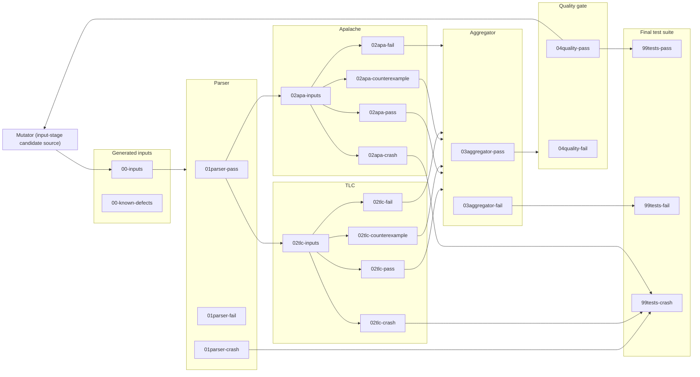

# General fuzzing workflows

**Author:** Igor Konnov

This document captures our approach to generating high-quality TLA<sup>+</sup>
specifications. We call this process "fuzzing" in general, independently of whether we are using random generators (in
the spirit of property-based testing), or using genetic algorithms with coverage feedback (in the spirit of AFL and
cargofuzz).

## 1. Processing pipeline

The input-generation, parser, TLC, Apalache, conformance-aggregator and
quality-gate stages described below are implemented, and so is the mutator,
as a candidate source of the input stage. The final test-suite stages remain
proposals. [ADR 0001][] records the stage and worker execution model.
[ADR 0002][] records the property-based input admission policy. [ADR 0005][]
records the separate model-checker counterexample verdict. [ADR 0006][] records
the known-defect admission filter. [ADR 0008][] records the exploration metrics
that the model-checker stages store. [ADR 0010][] records generations, the
quality gate that ranks entries by those metrics, and the mutator
([mutation manual][]). [ADR 0009][] records `fuzztla export-db`, which exports a
corpus to a SQLite database for analysis ([corpus-database manual][database
manual]).

### 1.1. General architecture

Our fuzzing workflows follows the general architecture that is shown in the figure below. In certain workflows, some of
the stages may be missing. In the future, we may add additional stages. Nevertheless, we believe that this architecture
is general enough to encompass many fuzzing frameworks.

The implemented input stage uses stratified rejection sampling to prevent empty
collection literals from dominating the corpus. For each target entry, it selects
one collection-richness cohort uniformly and retains that cohort until it admits a
unique input. Workers claim target entries dynamically, and each target draws its
cohort and candidates from its own stream, seeded by the generation seed and the
target's ordinal, so which worker fills a target does not change what it admits
([ADR 0010][]). This policy belongs to the workflow; the IR decoders remain
deterministic mappings from bytes to IR. The richness score covers the
expressions an input decoded to, each counted once, rather than the assembled
module: the module also holds the fixed skeleton, and the expression wrapper
repeats its one expression in two definitions, so scoring the module would make
a stored score depend on the skeleton rather than on the input. Admission also
rejects a candidate whose assembled module renders to more TLA<sup>+</sup> source
than one worker request frame holds, so no stored entry can only be crashed on by
the parser and TLC.

**Implemented architectural extension.** A run proceeds in generations
([ADR 0010][]). One invocation-long `StageGraph` processes stage work from at
most two adjacent generations. After generation g fills its admission quota,
`workflow.GenerationLoop` admits the PBT share of generation g + 1 while g's
checker tail runs. It gates g only after every one of its entries reaches a
terminal stage outcome, then admits the mutant share of g + 1 from the selected
parents.
Queued parser and checker work, and CPU-budget requests, from the older
generation take priority; the aggregator is exempt, since aggregating an entry
releases the checker capacity every generation needs. A stage reports a
transition only after it has durably moved the entry, and before it forwards it.
Reports from different stages are otherwise unordered: the aggregator can report
an entry before the slower checker does, and the generation tracker accepts that
late checker report. `corpus.CorpusStage`
carries the pipeline role these rules key on, so adding a stage does not mean
editing them. The loop runs one generation per `generation_size` entries of
`workflow.max_entries`. The input stage draws each target entry from a
`CandidateSource`: `PbtCandidates` implements the cohort policy above, and
`MutantCandidates` mutates a parent from `04quality-pass` with the byte
operators of the `mutation` package. `[mutator] feedback_ratio` fixes the share
of mutant targets. Both sources share one attempt loop, so a mutant is decoded,
admitted, deduplicated, quarantined and stored exactly like a PBT candidate. A
mutant that renders to its parent's module is rejected as a clone. The mutator
is not a stage: it records no verdict and owns no directory.

Startup recovery reconstructs unfinished entries and the oldest incomplete
generation from the existing corpus format. Durable admission and stage
transitions update that state in memory during the invocation; no full-corpus
inventory scan occurs between generations. `corpus.EntryProgress` is the one
definition of what recovery reads and what the run accumulates, so the two cannot
disagree. A corpus with entries still in flight or ungated in a generation more
than one before its latest stops the run: the loop admits at most one generation
ahead, so nothing older can have been left open. A generation that is merely
short of `generation_size` does not, since raising `generation_size` between runs
makes every finished generation look short. A final validation runs after the
workers stop. The progress
display names the oldest ungated generation.

**Implemented architectural extension.** Admission ends with the known-defect
signatures listed in `[workflow.inputs] known_defects` ([ADR 0006][]). A
signature is a pattern over the IR of the code the tools evaluate, matching a
shape that a tool is documented to reject. A matching candidate is not
admitted to `00-inputs`. It is stored in `00-known-defects` while its primary
signature has fewer than `known_defect_samples` stored entries, and only counted
otherwise. The check runs after the richness threshold and the request-frame
limit and draws no randomness, so with no database the admitted stream is
unchanged. `fuzztla init` lists the repository's `signatures/known-defects.toml`,
so a new corpus consults it unless its configuration says `known_defects = []`.
The [manual][known-defect manual] specifies the database format and the pattern
language.

Every tool stage regenerates the same closed, typed IR from the stored bytes and
the invocation's immutable prepared operator library.
Which decoder it uses is a property of the entry rather than of the run: the
envelope's `kind` field names it, `workflow.spec.SpecDecoders` pairs each kind
with its decoder, and `generator.kind` selects only what a run *generates*, so a
corpus may hold entries of more than one kind. An `expr` entry is wrapped in the
fixed single-state module; a `module` entry decodes to a whole module's
declarations. Either way the stage receives one assembled module and a
`CheckRequest`: the exploration depth it asks for and whether it has a temporal
property.

Every assembled module defines the entry points `Init`, `Next`, `Inv`,
`Fairness`, `Spec`, `Prop` and `Liveness`
([ADR 0007](../decisions/0007-levels-and-temporal-properties.md)). TLC checks
`SPECIFICATION Spec` against `INVARIANT Inv`, and against `PROPERTY Prop` when the
module has a property. Apalache checks `--init=Init --next=Next --inv=Inv` with
the requested unrolling length, and `--temporal=Liveness` when the module has a
property; `Liveness` is `Fairness => Prop`, because Apalache supports no fairness
in a specification.

The parser and TLC consume a TLA+ module rendered through Apalache's Java I/O
facade. Apalache instead consumes its typed IR JSON format through the same
facade, which preserves the type tag on every expression and avoids inferring
types again from lossy source syntax. The checker renderer continues to replace
each `LABEL` with its first operand before serialization. Labels are semantically
transparent to the model checker, and the parser and TLC retain the original
labeled expression. The pinned snapshot can decode labels, but this compatibility
normalization remains in place so the facade migration does not also change
checker inputs; [the JSON label finding][] tracks its eventual removal.

In the figure below, the outer boxes are the stages of the pipeline, while the inner boxes are directories in the
corpus. The names of the directories reflect the status of each input within the stage.



### 1.2. Custom-operator preparation

**Implemented architectural extension.** Before constructing decoders, the workflow
prepares the modules selected by `generator.custom_operators`. `generator.classpath`
is an ordered list of directories or JARs; paths read from TOML are resolved against
that file's directory. Directory roots and JAR root resources contain `Module.tla`;
JARs may also use `tla2sany/StandardModules/Module.tla`. First occurrence wins.
Bundled standard module names cannot be overridden. For inline-linked modules, JARs
supply source resources, not executable Java operator overrides; instance-linked
modules (below) put the classpath, overrides included, on the parser and TLC.

`workflow.library.LibrarySources` copies the source search path into a private
snapshot, bounded to 32 MiB. The snapshot includes unselected source files so SANY
can resolve transitive `EXTENDS` and `INSTANCE` dependencies without a second,
ad-hoc dependency parser. SANY in the pinned Apalache distribution performs the
actual module lookup. The entire source snapshot, including unused files, belongs
to the replay identity.

`LibraryTypechecker` invokes that distribution as an isolated CLI process:
`typecheck --infer-poly=true --output=<module.json> <module.tla>`. It runs once per
configured root module, not per candidate or stage. For an instance-linked module,
the root is a generated wrapper `EXTENDS <Module>`, so the library holds what
Apalache itself imports, including its rewired Community Modules. It uses a private working
directory, explicit Apalache configuration and row typing, bounded diagnostics,
and the Apalache stage's heap and timeout settings. Cancellation interrupts the
wait and terminates the child; it does not poll the process. All scratch files are
removed on completion or failure. No Maven importer/typechecker dependency is
introduced. With no selected modules, preparation does not inspect paths or launch
a process.

The Java I/O facade's direct typed-IR JSON reader loads output of at most 64 MiB,
after `LibraryJson` prunes operator declarations that no selected operator reaches:
the reader rejects a whole module when one declaration uses an internal operator it
does not know ([apalache-json-003](../../findings/apalache-json/apalache-json-003.md)).
Its builder-backed alternative is deliberately not used: it incorrectly
reconstructs a polymorphic empty set as a set of sets. Library validation then
checks supported types, dependency closure, first-order signatures and state-free
syntax. Preparation errors stop the invocation; they are not input rejections or
checker-stage verdicts.

`SpecDecoders` captures the prepared library for both input kinds. `OperatorLibrary`
links each used definition closure into the assembled module with fresh IR
identities. Apalache's JSON input is always self-contained. Each `custom_operators`
entry has a linkage ([ADR 0014](../decisions/0014-per-checker-library-linking.md)):
with `link = "inline"` (default), the TLA+ source of the parser and TLC is the same
self-contained module and needs no checker classpath. With `link = "instance"`,
`SpecArtifact.source()` replaces each used export by an alias
`<export>(p1, …) == <instance>!<Operator>(p1, …)`, and `SpecText` splices the named
`INSTANCE` and alias declarations after `EXTENDS` as text. The parser and TLC workers
then receive `generator.classpath` in front of their class path. **Deviation:** this
revises the earlier rule that every checker input is self-contained; instance-linked
TLA+ sources resolve on the corpus's `tla/` directory. Standalone expression printing
uses a surrounding `LET`; richness scoring and known-defect matching retain the
self-contained IR, so admission does not depend on linkage.

**Implemented architectural extension** ([ADR 0015](../decisions/0015-diff-linked-libraries.md)).
`link = "diff"` requires a key `tlc_module`, which names a different module with the same
operators and arities.

- Apalache typechecks `module` as root, without a wrapper. It supplies the signatures,
  the mangled names and the self-contained IR.
- The TLA+ source defines the aliases through `INSTANCE <tlc_module>`, which fuzztla never
  imports. The TLC side may therefore use `RECURSIVE` and recursive functions, and the
  aggregator compares them with the Apalache side's folds.
- Preparation parses the instance and alias declarations of every instance- or
  diff-linked module once with SANY. Unresolvable aliases therefore stop the invocation
  instead of failing every input.

**Deviation:** library validation covers only the Apalache side of a diff-linked
operator. The TLC side is checked only for its interface: the module exists and
exports each operator with the right arity.

The first custom-library run records `.operator-library` atomically under the
corpus lock, before admitting inputs. It contains the ordered export selection
with non-default linkages and the `tlc_module` of each diff-linked module,
source filenames and SHA-256 digests, the pinned Apalache JAR digest, and, with
instance or diff linkage, the digest of every classpath file. Subsequent
runs and `print --corpus` require an exact match. Paths may move without changing
identity. A missing manifest cannot be initialized over existing inputs, and
read-only printing never creates one. Removing the custom library from the config
also fails verification if a manifest exists. To change a library, initialize a
new corpus. `fuzztla init --library FILE` copies a library's classpath into
`<corpus>/tla/` so that each corpus keeps its release. Storage reads and writes opaque
bytes; this validation policy belongs to the workflow.

### 1.3. Conformance testing of TLC vs. Apalache with random inputs

In this workflow, the goal is to collect a differential testing suite. This test suite contains three kinds of test
inputs:

- **Positive tests.** These specifications show that TLC and Apalache report the
  same non-crash verdict.
- **Negative tests.** These specifications show that TLC and Apalache report
  different non-crash verdicts. In particular, they preserve cases in which
  exactly one checker produces a counterexample.
- **Crash tests.** One of the model checkers crashes on the input.

This workflow specializes the general workflow as follows:

- **Aggregator.** At this stage, the input is moved to `pass` when TLC and Apalache
  report the same non-crash verdict: pass/pass, counterexample/counterexample, or
  fail/fail. Any verdict disagreement moves to `fail`. In particular, a
  counterexample from exactly one checker is a conformance failure, including
  counterexample/fail: an ordinary checker failure does not claim that the
  invariant was violated. Failure codes are diagnostic metadata and do not affect
  this verdict-level comparison. A crash in either checker is not aggregated and
  remains in the checker result directories.
- **Quality gate.** The gate walks the admissible entries of a settled
  generation in rank order and keeps those that show a behaviour or cover code
  the kept entries lack, up to `[mutator] select_fraction` of the generation, in
  `04quality-pass`; the rest move to `04quality-fail` ([ADR 0010][],
  [ADR 0013][]). An entry is admissible when its TLC verdict is not `fail`, TLC
  measured its exploration, and it matches none of the enabled shallow patterns
  of [ADR 0008][]. Admissible entries are ranked lexicographically by projected
  depth, projected states, discovering actions and state shape. An entry is
  kept if its behaviour cell (TLC verdict and bucketed rank key) holds fewer
  than `cell_capacity` kept entries, over every generation, or if `feature_coverage` is
  enabled and it adds an operator-edge feature of its evaluated code. The
  gate replays inputs through the generator to compute these features. It
  commits every pass in rank order before any fail, so rerunning it after an
  interruption completes the same placement.
- **Mutator.** The mutator derives `[mutator] feedback_ratio` of each
  generation from `04quality-pass` by byte-level edits; PBT supplies the rest.
  With `feedback_ratio = 0`, or before any entry passes the gate, a generation
  is PBT only.

### 1.4. Metamorphic testing of TLC and Apalache

**Proposed architectural extension** ([ADR 0016][]; [manual][metamorphic manual]).
Nothing in this section is implemented.

In this workflow, the goal is to collect a metamorphic test suite. Each input pairs a
generated module M1 with a rewrite M2 that is equivalent in TLA<sup>+</sup>. One checker
checks a module that relates the two, so no second checker is the oracle. The test
suite contains three kinds of test inputs:

- **Positive tests.** The checker preserves the relation.
- **Negative tests.** The checker reports a violation: it evaluates two equivalent
  specifications differently, or a rewrite rule is unsound.
- **Crash tests.** The model checker crashes on the input.

**Notation.** An entry's orientation designates one of M1 and M2 as the *explored side*
E and the other as the *checked side* C. For a side X ∈ {E, C}, the relation module
contains the following definitions, copied from X:

| Definition | Meaning |
| --- | --- |
| `InitX` | initial predicate |
| `ActionX` | next-state action without its stuttering disjunct |
| `InvX` | state invariant |
| `PropX` | temporal property |
| `FairnessX` | fairness conditions |
| `exprX` | the expression of an `expr` entry |

`vars` is the tuple of state variables, which M1 and M2 share.

The workflow reuses every stage. Only the technique, the payload, the assembled module
and the aggregator's policy differ:

- **Technique.** `fuzztla run --how=mt` enables the workflow. The first run records
  the technique in the corpus file `.technique`, and later runs must match it. Entries
  keep their kind, `expr` or `module`.
- **Inputs.** Under `mt`, a payload is a two-byte base length, the payload of an
  `expr` or `module` entry, and a rewrite payload. A byte-directed rewriter in
  `gen.rewrite` decodes the rewrite payload into an orientation bit and rule
  applications. A rule is an operator `F(x, y) == A = B` of a TLA<sup>+</sup> rule
  module ([ADR 0017][]). The rule catalog is the subject of a later ADR.
- **Relation module.** `FuzzInputModule` assembles an implication `E ⇒ C`. For
  `module`:
  - `Init == InitE` and `Next == ActionE \/ UNCHANGED vars`;
  - `Inv == (step = 0 => InitC) /\ (InvE <=> InvC)`, which checks `InitE ⇒ InitC`,
    since `step = 0` holds exactly in the initial states;
  - the action invariant `Step == [ActionC]_vars`, which checks `ActionE ⇒ ActionC`
    on every transition. TLC checks it as `PROPERTY [][Step]_vars`, and Apalache as
    `--inv=Inv,Step`;
  - for a module with a property, `Prop == (PropE => PropC) /\ (PropC => PropE)`
    under the fairness conditions `FairnessE`.

  Deadlock detection stays off. For `expr`, `Init == v = exprE`,
  `Next == UNCHANGED v` and `Inv == v = exprC`.
- **Checkers.** `[workflow] checkers` selects the model-checker stages. A TLC-only
  corpus can check rewrites into recursive definitions, which Apalache rejects.
- **Aggregator.** The corpus technique selects the oracle. A metamorphic entry passes
  when the configured checkers agree and none reports a counterexample.
- **Candidate sources.** PBT and the mutator apply unchanged. A third source lifts
  the `04quality-pass` entries of a read-only `pbt` base corpus by appending random
  rewrite payloads.
- **Quality gate.** Unchanged. The relation reaches exactly the states of the
  explored module, so its exploration metrics are that module's.

### 1.5. Coverage-based fuzzing

In this workflow, the goal is to generate a test suite that produces a high coverage of the model checker's source code.
This test suite contains one kind of test inputs:

- **Positive tests.** These tests do not fail the model checker and increase the source code coverage of the model
  checker.
- **Crash tests.** The model checker crashes on the input.

It is not clear to us, what kind of negative tests we can produce in this case.

This workflow specializes the general workflow as follows:

- **Aggregator.** At this stage, the input is move to `pass`, when both TLC and Apalache pass.
- **Mutator.** The mutator transforms the input (the byte array) with genetic mutations.
- **Quality gate.** The input increases the source code coverage.

## 2. Encoding corpus inputs

### 2.1. Motivation

Fuzzers usually store corpus inputs in the binary form, without adding any metadata.
Since our fuzzing workflow moves inputs along various stages, we have to add metadata.

Importantly, we need a flexible format: Adding new fuzzing stages
should not require modification of the other stages. Hence, rigid format that require
fixed schemas and serialization/deserialization would be a bad choice here. JSON
is an obvious candidate, but it's a text format, and it makes it inconvenient to
store binary inputs.

[CBOR] is a binary analogue of JSON. In the following, we specify the general
rules of using CBOR to encode inputs and their metadata in our fuzzing framework.
We use the CBOR diagnostic notation to explain the format. Use [cbor playground][]
to experiment with the format.

### 2.2. Minimal fields

A minimalistic input with metadata looks as follows:

```cbor
{
    "kind": "expr",
    "input": h'0123af'
}
```

The fields have the following meaning:

 - The field `"input"` contains a byte array that is decoded by the IR generators.
 - The field `"kind"` tells the fuzzer how to decode `"input"`:
    - When `"kind"` is `"expr"`, the field `"input"` encodes a single TLA<sup>+</sup> expression,
      which the workflow wraps in a fixed single-state module.
    - When `"kind"` is `"module"`, the field `"input"` encodes the declarations of a single
      TLA<sup>+</sup> module: its state variables, operator definitions, initial-state
      predicate, next-state action, invariant, and an optional temporal property with
      fairness.

   The two encodings are independent, so a change to one cannot reinterpret an
   entry stored under the other.

### 2.3. Corpus storage

Corpus inputs are stored in `<stage-status>/<sha256>.cbor`:

 - The filename contains the lowercase SHA-256 digest of the byte string in `"input"`,
   not of the complete CBOR document. A stage may therefore add or update metadata
   without changing the input's identity or filename. Consequently, the same byte
   string under another `kind` is a duplicate rather than a second entry; a mixed-kind
   corpus stores at most one interpretation of any payload.

 - `<stage-status>` is a directory like `00-inputs` and `02tlc-pass`.
   Every directory belonging to an implemented stage is required; workflow runs
   do not migrate incomplete corpus layouts.

 - A parser or checker crash also produces a `.stacktrace` sidecar, for example
   `01parser-crash/<sha256>.stacktrace`,
   `02tlc-crash/<sha256>.stacktrace`, or
   `02apa-crash/<sha256>.stacktrace`, beside the corresponding CBOR entry.
   The UTF-8 sidecar contains the Java stack trace when the tool threw an
   exception, or a diagnostic for non-exceptional crashes such as a timeout or a
   rendered specification too large for one worker request frame.
   Sidecars are not corpus entries and do not count towards capacity limits.

 - A parser pass is the durable fan-out point. The same parser output is copied
   to `02tlc-inputs` and `02apa-inputs`, then removed from `01parser-pass`.
   These two physical files have one logical identity and count once towards
   the global corpus limit. Inventory recovery completes a partial fan-out and
   requires both branches to agree on the input, generation metadata, and
   parser metadata.

 - The conformance aggregator is a durable fan-in point. It has no input
   directory: completed checker result paths are queue notifications, and
   startup reconstructs ready pairs from `02tlc-{pass,counterexample,fail}` and
   `02apa-{pass,counterexample,fail}`. The aggregator merges both stage maps
   into one entry in `03aggregator-pass` or `03aggregator-fail`. It installs
   that destination before deleting either checker source and completes
   interrupted source deletion at
   startup. The merged entry preserves both checker failure classifications and
   unrecognized envelope fields. Aggregated checker results still contribute to
   historical checker verdict counters but no longer occupy checker result
   capacity. Pairs containing a checker crash are left in the checker result
   directories.

 - The quality gate consumes `03aggregator-pass` without owning it, and moves
   each entry of a settled generation to `04quality-pass` or `04quality-fail`
   with an ordinary stage transition, so startup recovery finishes a move whose
   `stages.quality` metadata was committed. A gated entry still counts as an
   aggregator pass, and its checker verdicts still count for both checkers. The
   gate is bounded only by the global corpus limit. The mutator reads its
   parents from `04quality-pass` and stores its mutants in `00-inputs`; it owns
   no directory.

 - An unexpected failure while generating or preparing an input produces
   `.work/generator-crash/<sha256>.cbor` and a matching `.stacktrace`. This
   diagnostic copy preserves the exact generator bytes without admitting the
   failing input to a stage directory. It persists across workflow invocations
   and does not count towards capacity limits.

 - `00-known-defects/<sha256>.cbor` holds candidates that matched a known-defect
   signature. The directory is created on first use and belongs to no stage: no
   queue reads it, recovery does not inventory it, and it counts towards no
   capacity limit. Its entries keep their digest identity, so generating one
   again yields a duplicate. Each entry lists the matching signature ids in
   `gen.knownDefects`. A run counts the directory's entries by primary signature
   at startup and keeps at most `known_defect_samples` per signature.

 - `.workflow-stats.cbor` stores cumulative elapsed time and generator
   aggregates that cannot be reconstructed cheaply or exactly from corpus
   entries. The runner reads it after corpus validation and atomically replaces
   it once on every controlled exit, while it still holds the corpus lock. A
   missing file means that no historical statistics were recorded. The runner
   does not scan per-entry timestamps to reconstruct elapsed time and does not
   checkpoint statistics during a run. Consequently, `SIGKILL`, host-JVM
   termination, or power loss discards statistics from the current invocation;
   corpus stage state remains recoverable from the stage directories.

The aggregate has this shape. Elapsed values are monotonic-clock nanoseconds;
richness statistics cover `richnessSamples` admissions recorded since the
aggregate was first created. `elapsedNs.stages` is keyed by stage metadata name.
A stage the reader does not know is ignored, and a stage the document omits
contributes zero, so adding or removing a stage needs no migration.
`generator.knownDefects` maps a primary signature id to the number of candidates
that matched it, stored or not; it is omitted while no candidate has matched.
`generator.clones` counts mutants rejected because they render to their parent's
module.

```cbor
{
  "elapsedNs": {
    "total": 0,
    "generator": 0,
    "stages": {
      "parser": 0,
      "tlc": 0,
      "apalache": 0,
      "aggregator": 0,
      "quality": 0
    }
  },
  "generator": {
    "attempts": 0,
    "rejected": 0,
    "richnessRejected": 0,
    "duplicates": 0,
    "clones": 0,
    "knownDefects": { "modulo-by-literal-zero": 0 },
    "richnessSamples": 0,
    "minimumRichness": 0.0,
    "maximumRichness": 0.0,
    "averageRichness": 0.0
  }
}
```

### 2.4. Admission metadata

Every admitted input records the generation that admitted it, its admission
cohort and its collection-richness score in the compact `"gen"` field:

```cbor
{
    "kind": "expr",
    "input": h'0123af',
    "gen": {
      "generation": 0,
      "cohort": 7,
      "richness": 18.0
    }
}
```

A mutant also records the digest of the parent it was mutated from and the
operators applied, in order ([ADR 0010][]). The two fields appear together or
not at all. A mutant keeps its parent's cohort and records its own richness.

```cbor
{
    "kind": "module",
    "input": h'0123af',
    "gen": {
      "generation": 2,
      "cohort": 3,
      "richness": 4.0,
      "parent": "f8d0eea82ac8…",
      "operators": ["random_byte"]
    }
}
```

The workflow requires `generation` on every entry of a stage directory. A reader
still decodes an envelope written before generations existed, so `fuzztla print`
and `fuzztla export-db` work on it, but a run rejects the corpus.

A quarantined entry in `00-known-defects` also lists, under `knownDefects`, the
known-defect signatures it matched in database order; the first is its primary
signature. Admitted entries omit the field.

```cbor
{
    "kind": "module",
    "input": h'0123af',
    "gen": {
      "generation": 0,
      "cohort": 3,
      "richness": 4.0,
      "knownDefects": ["modulo-by-literal-zero", "string-set"]
    }
}
```

The metadata describes the admission decision; it is not recomputed by later
stages. A stage must preserve it when updating the envelope. It does not
participate in the input identity: the filename remains the digest of `"input"`.
[ADR 0002][] specifies the score and cohort schedule, and [ADR 0010][]
generations and mutation.

### 2.5. Stage

When an input passes through a stage, this stage stores its metadata under `stages.<stage name>`.
The metadata depends on the stage. The minimal set of fields is:

 - The field `"verdict"` contains the status of passing through the stage. It is
   one of `"pass"`, `"counterexample"`, `"fail"`, `"crashed"`. The
   `"counterexample"` verdict is produced only by model-checker stages and means
   that the checker reported a property violation; it is distinct from a
   classified evaluation, typechecking, or parsing failure. These are the
   outcomes the corpus stores entries by, so a reader rejects any other value
   rather than treating it as an extension. The stage *name* stays open: an entry
   may record a stage the reader does not know, and the reader preserves that
   metadata unchanged.
 - The field `"startTime"` contains an [epoch-based date/time][] of the moment
   when a stage worker started to process the input. This timestamp must be in UTC.
 - The field `"endTime"` contains an [epoch-based date/time][] of the moment     
   when a stage worker stopped to process the input. This timestamp must be in UTC.
   If there is no meaningful difference between the start and end times, then
   `"startTime"` and `"endTime"` must be equal.
 - A failed model-checker stage also contains the integer field `"code"`. The
   code uses the shared TLC/Apalache registry defined by [ADR 0003][]. Model-checker
   stages require this field for `"fail"` and forbid it for other verdicts,
   including `"counterexample"`.
 - A model-checker failure may contain a single-line `"detail"` of at most 80
   Unicode characters. This text is non-semantic and must not affect verdicts,
   corpus placement, or conformance comparison. Offline triage tooling may use
   conservative signatures over it to assign advisory labels that are not stored
   in the corpus envelope. It is valid only when `"code"` is present.

- A model-checker stage may contain a `"metrics"` map that describes what the
  checker explored ([ADR 0008][]). It is written for `"pass"`,
  `"counterexample"` and `"fail"` and forbidden for `"crashed"`. TLC records
  the exploration phase, state counts, depth, the next-state disjuncts that fired,
  and the shape of the largest state. TLC and Apalache record `"traceLength"`,
  which is allowed only with `"counterexample"`. A count that was not measured is
  absent, and a reader preserves metric fields it does not know. The
  [exploration-metrics manual][metrics manual] lists the fields.

- The quality gate records `stages.quality` with the `"pass"` or `"fail"`
  verdict and the two timestamps, and nothing else: the rank and the matched
  shallow pattern derive from the stored metrics ([ADR 0010][]).

```cbor
{
    "kind": "expr",
    "input": h'0123af',
    "stages": {
      "parser": {
        "verdict": "pass",
        "startTime": 1(1786635967),
        "endTime": 1(1786635990)
      },
      "tlc": {
        "verdict": "fail",
        "code": 75,
        "detail": "Attempted to apply Head to the empty sequence.",
        "startTime": 1(1786635990),
        "endTime": 1(1786635991)
      }
    }
}
```

[CBOR]: https://cbor.io/
[cbor playground]: https://cbor.me
[epoch-based date/time]: https://www.rfc-editor.org/rfc/rfc8949.html#name-epoch-based-date-time
[ADR 0001]: ../decisions/0001-stages-and-workers.md
[ADR 0002]: ../decisions/0002-pbt-richness-score.md
[ADR 0003]: ../decisions/0003-checker-failure-codes.md
[ADR 0005]: ../decisions/0005-counterexample-verdict.md
[ADR 0006]: ../decisions/0006-known-defect-signatures.md
[ADR 0008]: ../decisions/0008-exploration-metrics.md
[ADR 0009]: ../decisions/0009-corpus-database.md
[ADR 0010]: ../decisions/0010-mutation.md
[ADR 0013]: ../decisions/0013-behaviour-archive-and-operator-coverage.md
[ADR 0016]: ../decisions/0016-metamorphic-testing.md
[ADR 0017]: ../decisions/0017-rewrite-rule-library.md
[metamorphic manual]: ../manual/metamorphic-testing.md
[database manual]: ../manual/corpus-database.md
[mutation manual]: ../manual/mutation.md
[metrics manual]: ../manual/exploration-metrics.md
[known-defect manual]: ../manual/known-defect-signatures.md
[the JSON label finding]: ../../findings/apalache-json/apalache-json-001.md
