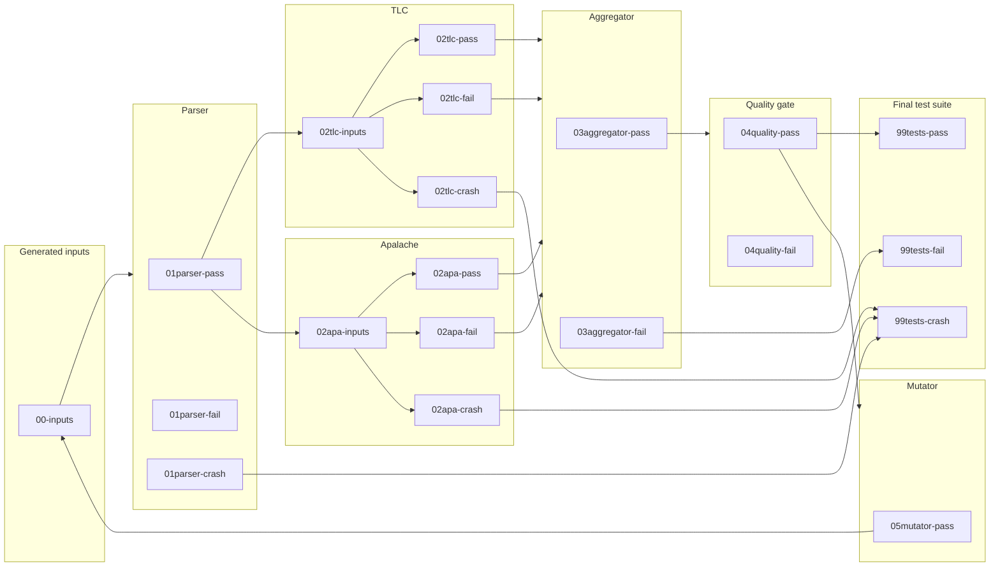

# General fuzzing workflows

**Author:** Igor Konnov

This document captures our approach to generating high-quality TLA<sup>+</sup>
specifications. We call this process "fuzzing" in general, independently of whether we are using random generators (in
the spirit of property-based testing), or using genetic algorithms with coverage feedback (in the spirit of AFL and
cargofuzz).

## 1. Processing pipeline

The input-generation, parser, TLC, and Apalache stages described below are
implemented. Later stages remain architectural proposals. [ADR 0001][] records
the stage and worker execution model. [ADR 0002][] records the property-based
input admission policy.

### 1.1. General architecture

Our fuzzing workflows follows the general architecture that is shown in the figure below. In certain workflows, some of
the stages may be missing. In the future, we may add additional stages. Nevertheless, we believe that this architecture
is general enough to encompass many fuzzing frameworks.

The implemented input stage uses stratified rejection sampling to prevent empty
collection literals from dominating the corpus. For each target entry, it selects
one collection-richness cohort uniformly and retains that cohort until it admits a
unique input. Each generator worker has deterministic, independent candidate and
cohort streams derived from the run seed. Workers claim target entries
dynamically. This policy belongs to the workflow; the IR decoder remains a
deterministic mapping from bytes to an expression.

In the figure below, the outer boxes are the stages of the pipeline, while the inner boxes are directories in the
corpus. The names of the directories reflect the status of each input within the stage.



### 1.2. Conformance testing of TLC vs. Apalache with random inputs

In this workflow, the goal is to collect a differential testing suite. This test suite contains three kinds of test
inputs:

- **Positive tests.** These specifications show that TLC and Apalache agree on model checking of the specifications.
- **Negative tests.** These specifications show that one of the model checkers produces a counterexample, while another
  model checker does not.
- **Crash tests.** One of the model checkers crashes on the input.

This workflow specializes the general workflow as follows:

- **Aggregator.** At this stage, the input is moved to `pass`, when both TLC and Apalache pass, or both fail. Failure
  codes are diagnostic metadata and do not affect this verdict-level comparison.
- **Mutator.** The mutator is no-operation. It does not generate new inputs.
- **Quality gate.** Good quality gates are to be found.

### 1.3. Metamorphic testing of TLC and Apalache

In this workflow, the goal is to collect a metamorphic test suite. This test suite contains two kinds of test inputs:

- **Positive tests.** These tests demonstrate that the model checker preserves equivalent transformations, as expected.
- **Negative tests.** These tests demonstrate soundness issues in the model checker. They present two equivalent
  expressions that are not equal in the model checker's interpretation.
- **Crash tests.** The model checker crashes on the input.

This workflow specializes the general workflow as follows:

- **Aggregator.** At this stage, the input is move to `pass`, when both TLC and Apalache pass.
- **Mutator.** The mutator applies equivalent transformations to some operators of the specification that corresponds to
  the input.
- **Quality gate.** Good quality gates are to be found.

### 1.4. Coverage-based fuzzing

In this workflow, the goal is to generate a test suite that produces a high coverage of the model checker's source code.
This test suite contains one kind of test inputs:

- **Positive tests.** These tests do not fail the model checker and increase the source code coverage of the model
  checker.
- **Crash tests.** The model checker crashes on the input.

It is not clear to us, what kind of negative tests we can produce in this case.

This workflow specializes the general workflow as follows:

- **Aggregator.** At this stage, the input is move to `pass`, when both TLC and Apalache pass.
- **Mutator.** The mutator transforms the input (the byte array) with genetic mutations.
- **Quality gate.** The input increases the source code coverage.

## 2. Encoding corpus inputs

### 2.1. Motivation

Fuzzers usually store corpus inputs in the binary form, without adding any metadata.
Since our fuzzing workflow moves inputs along various stages, we have to add metadata.

Importantly, we need a flexible format: Adding new fuzzing stages
should not require modification of the other stages. Hence, rigid format that require
fixed schemas and serialization/deserialization would be a bad choice here. JSON
is an obvious candidate, but it's a text format, and it makes it inconvenient to
store binary inputs.

[CBOR] is a binary analogue of JSON. In the following, we specify the general
rules of using CBOR to encode inputs and their metadata in our fuzzing framework.
We use the CBOR diagnostic notation to explain the format. Use [cbor playground][]
to experiment with the format.

### 2.2. Minimal fields

A minimalistic input with metadata looks as follows:

```cbor
{
    "kind": "expr",
    "input": h'0123af'
}
```

The fields have the following meaning:

 - The field `"input"` contains a byte array that is decoded by the IR generators.
 - The field `"kind"` tells the fuzzer how to decode `"input"`:
    - When `"kind"` is `"expr"`, the field `"input"` encodes a single TLA<sup>+</sup> expression.
    - When `"kind"` is `"module"`, the field `"input"` encodes a single TLA<sup>+</sup> module.

### 2.3. Corpus storage

Corpus inputs are stored in `<stage-status>/<sha256>.cbor`:

 - The filename contains the lowercase SHA-256 digest of the byte string in `"input"`,
   not of the complete CBOR document. A stage may therefore add or update metadata
   without changing the input's identity or filename.

 - `<stage-status>` is a directory like `00-inputs` and `02tlc-pass`.
   Every directory belonging to an implemented stage is required; workflow runs
   do not migrate incomplete corpus layouts.

 - A parser or checker crash also produces a `.stacktrace` sidecar, for example
   `01parser-crash/<sha256>.stacktrace`,
   `02tlc-crash/<sha256>.stacktrace`, or
   `02apa-crash/<sha256>.stacktrace`, beside the corresponding CBOR entry.
   The UTF-8 sidecar contains the Java stack trace when the tool threw an
   exception, or a diagnostic for non-exceptional crashes such as a timeout.
   Sidecars are not corpus entries and do not count towards capacity limits.

 - A parser pass is the durable fan-out point. The same parser output is copied
   to `02tlc-inputs` and `02apa-inputs`, then removed from `01parser-pass`.
   These two physical files have one logical identity and count once towards
   the global corpus limit. Inventory recovery completes a partial fan-out and
   requires both branches to agree on the input, generation metadata, and
   parser metadata.

 - An unexpected failure while generating or preparing an input produces
   `.work/generator-crash/<sha256>.cbor` and a matching `.stacktrace`. This
   diagnostic copy preserves the exact generator bytes without admitting the
   failing input to a stage directory. It persists across workflow invocations
   and does not count towards capacity limits.

 - `.workflow-stats.cbor` stores cumulative elapsed time and generator
   aggregates that cannot be reconstructed cheaply or exactly from corpus
   entries. The runner reads it after corpus validation and atomically replaces
   it once on every controlled exit, while it still holds the corpus lock. A
   missing file means that no historical statistics were recorded. The runner
   does not scan per-entry timestamps to reconstruct elapsed time and does not
   checkpoint statistics during a run. Consequently, `SIGKILL`, host-JVM
   termination, or power loss discards statistics from the current invocation;
   corpus stage state remains recoverable from the stage directories.

The aggregate has this shape. Elapsed values are monotonic-clock nanoseconds;
richness statistics cover `richnessSamples` admissions recorded since the
aggregate was first created. `elapsedNs.stages` is keyed by stage metadata name.
A stage the reader does not know is ignored, and a stage the document omits
contributes zero, so adding or removing a stage needs no migration.

```cbor
{
  "elapsedNs": {
    "total": 0,
    "generator": 0,
    "stages": {
      "parser": 0,
      "tlc": 0,
      "apalache": 0
    }
  },
  "generator": {
    "attempts": 0,
    "rejected": 0,
    "richnessRejected": 0,
    "duplicates": 0,
    "richnessSamples": 0,
    "minimumRichness": 0.0,
    "maximumRichness": 0.0,
    "averageRichness": 0.0
  }
}
```

### 2.4. Property-based generation

Every property-based input records its admission cohort and collection-richness
score in the compact `"gen"` field:

```cbor
{
    "kind": "expr",
    "input": h'0123af',
    "gen": {
      "cohort": 7,
      "richness": 18.0
    }
}
```

The metadata describes the admission decision; it is not recomputed by later
stages. A stage must preserve it when updating the envelope. It does not
participate in the input identity: the filename remains the digest of `"input"`.
[ADR 0002][] specifies the score and cohort schedule.

### 2.5. Stage

When an input passes through a stage, this stage stores its metadata under `stages.<stage name>`.
The metadata depends on the stage. The minimal set of fields is:

 - The field `"verdict"` contains the status of passing through the stage. The
   typical values are: `"pass"`, `"fail"`, `"crashed"`.
 - The field `"startTime"` contains an [epoch-based date/time][] of the moment
   when a stage worker started to process the input. This timestamp must be in UTC.
 - The field `"endTime"` contains an [epoch-based date/time][] of the moment     
   when a stage worker stopped to process the input. This timestamp must be in UTC.
   If there is no meaningful difference between the start and end times, then
   `"startTime"` and `"endTime"` must be equal.
 - A failed model-checker stage also contains the integer field `"code"`. The
   code uses the shared TLC/Apalache registry defined by [ADR 0003][]. Model-checker
   stages require this field for `"fail"` and forbid it for other verdicts.
 - A model-checker failure may contain a single-line `"detail"` of at most 80
   Unicode characters. This text is for triage only and must not participate in
   automated comparison or grouping. It is valid only when `"code"` is present.

```cbor
{
    "kind": "expr",
    "input": h'0123af',
    "stages": {
      "parser": {
        "verdict": "pass",
        "startTime": 1(1786635967),
        "endTime": 1(1786635990)
      },
      "tlc": {
        "verdict": "fail",
        "code": 75,
        "detail": "Attempted to apply Head to the empty sequence.",
        "startTime": 1(1786635990),
        "endTime": 1(1786635991)
      }
    }
}
```

[CBOR]: https://cbor.io/
[cbor playground]: https://cbor.me
[epoch-based date/time]: https://www.rfc-editor.org/rfc/rfc8949.html#name-epoch-based-date-time
[ADR 0001]: ../decisions/0001-stages-and-workers.md
[ADR 0002]: ../decisions/0002-pbt-richness-score.md
[ADR 0003]: ../decisions/0003-checker-failure-codes.md
