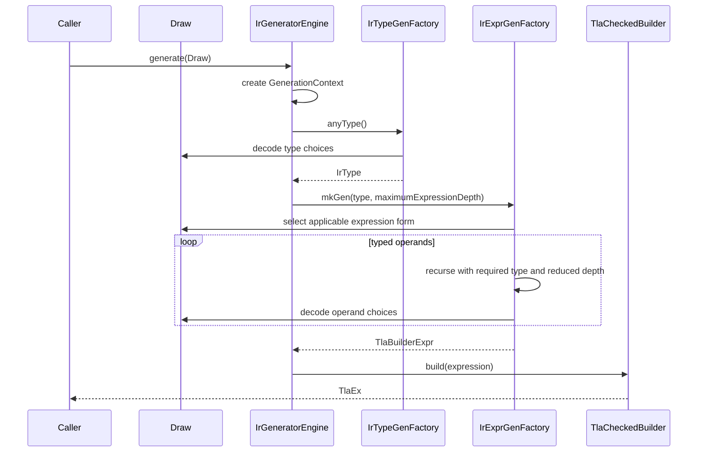

# IR generator architecture

**Author:** OpenAI Codex GPT 5.6-sol max

**Status:** Preliminary description of the implemented design

## 1. Purpose and scope

The packages `io.github.tlaplus.hardening.gen` and
`io.github.tlaplus.hardening.gen.engine` implement a deterministic decoder from
an arbitrary byte array to one typed Apalache TLA+ IR expression.
The decoder favors well-formed output from short inputs and remains useful under
byte-level mutation.

The generator produces a single `TlaEx`. It does not produce declarations or
modules, run a random search, maintain a corpus, or shrink failing inputs. The
[fuzzing workflow](fuzzing-workflows.md) supplies byte arrays and decides how to
store or mutate them.

The design has five primary requirements:

1. The same configuration and bytes produce the same IR.
2. Exhausted input produces small defaults instead of failing.
3. Local byte mutations should not unnecessarily perturb later decoding.
4. Successful generation returns an expression accepted by Apalache's
   `TlaCheckedBuilder`.
5. Explicit limits bound recursive construction and variable-size payloads.

## 2. Package structure

The package `io.github.tlaplus.hardening.gen` defines the public generator framework and the
IR-generator facade.

| Type | Responsibility |
| --- | --- |
| `Generator<T>` | Deferred recipe that consumes a shared `Draw` and produces one value. |
| `Draw` | Forward-only cursor over the input bytes and the primitive decoding protocol. |
| `BasicGenerators` | Combinators for constants, choices, bounded numbers, lists, and byte arrays. |
| `InputRejectedException` | Expected rejection of one semantically unsuitable input. |
| `IrGenerationConfig` | Resource limits for type and expression generation. |
| `IrGenerators` | Public factory for reusable `Generator<TlaEx>` instances. |

The package `io.github.tlaplus.hardening.gen.engine` implements type-directed IR
construction. Most engine types are package-private. `IrGeneratorEngine` is
public so callers that already own a `Draw` may invoke the coordinator directly.

| Component | Responsibility |
| --- | --- |
| `IrGeneratorEngine` | Creates per-run state, draws the result type and expression, and finalizes the checked builder computation. |
| `GenerationContext` | Owns the checked builder, lexical scope, fresh-name supplies, and immutable configuration for one run. |
| `IrType` and `IrTypeGenFactory` | Represent and generate the internal type model used to direct construction. |
| `ExpressionKind` and `ExpressionKinds` | Define the static catalog and byte-decoder order of expression forms. |
| `IrExprGenFactory` | Filters applicable forms, selects one, enforces expression budgets, and dispatches to a family factory. |
| `*ExprGenFactory` | Construct general, Boolean, integer, set, sequence, and remaining typed forms. |
| `NameScope` | Tracks typed lexical bindings with shadowing and exception-safe restoration. |
| `BuilderArrays` | Adapts typed lists to Apalache's generic varargs APIs. |

## 3. Generation protocol

The method `IrGenerators.expressions(config)` captures immutable configuration and returns
a reusable generator backed by `IrGeneratorEngine`. Each invocation creates a
new `GenerationContext`; no builder, scope, counter, or name supply crosses run
boundaries.

The engine first generates an `IrType`, then requests an expression of exactly
that type. Each expression form determines the types of its operands. For
example, equality first generates one value type and then generates two operands
of that type. A set filter generates its source element type, introduces a
binding of that type, and generates a Boolean predicate in the extended scope.

Factory methods such as `mkGen`, `expression`, `listOf`, and `oneOf` return
deferred computations. Creating a generator must not consume bytes, increment
the node counter, or allocate fresh names. These effects occur only when a
caller invokes the returned generator with a `Draw`. This invariant permits
ordinary `Generator.map` and `Generator.flatMap` composition without hidden
cursors or random sources.

## 4. Byte decoding

All nested generators share one mutable `Draw`. The cursor is neither copied nor
reset during composition. A generator may leave an unused suffix.

The primitive mappings are:

- A byte is interpreted as an unsigned integer in `0..255`.
- A Boolean uses the low bit: even is false and odd is true.
- A bounded `long` consumes the minimum whole number of bytes required for the
  inclusive range. It interprets them in big-endian order and applies unsigned
  modulo reduction.
- A choice draws a bounded index and selects the corresponding list element.
- Once the input is exhausted, byte reads return zero without advancing the
  cursor. Choices consequently prefer their first alternative.

Modulo reduction introduces the minimum possible imbalance for a fixed byte
width: each alternative receives either the floor or ceiling of the available
byte patterns divided by the number of alternatives. The decoder does not use
rejection sampling because variable retry counts would shift the interpretation
of all subsequent bytes.

Variable-size values use continuation markers rather than length prefixes.
`BasicGenerators.listOf` and `byteArray` first generate their mandatory elements.
Before each optional element, they read one Boolean marker: odd continues and
even terminates. Reaching the configured maximum consumes no additional marker.
This layout avoids a dedicated size byte whose mutation could add or remove many
elements at once.

The byte encoding is implementation-local. Enum declaration order, expression
catalog order, or generator composition changes may reinterpret an existing
input. The corpus therefore preserves raw inputs, but the project does not yet
promise cross-version decoding compatibility.

## 5. Type-directed construction

The sealed `IrType` model covers Boolean, integer, string, model-value, set,
sequence, function, tuple, record, variant, and operator types. Each type converts
to an Apalache `TlaType1`. Keeping this model separate from the builder types
makes recursive matching and Java pattern matching explicit.

The method `IrTypeGenFactory.anyType()` permits a value type as well as an
operator type at the root, whereas the method
`valueType()` excludes operator types and is used for operands and collection
elements. Nested type generation carries a remaining-depth budget. At zero, it
selects only primitive or model-value types. Tuples, records, and variants use
terminated nonempty component lists; operator argument lists may be empty.

Expression kinds are grouped by construction responsibility:

- `GeneralExprGenFactory` handles terminals, names, conditionals, `CHOOSE`,
  `CASE`, applications, `LET`, prime, folds, sequence head, and variant access.
- `BooleanExprGenFactory` handles propositional, relational, quantified, action,
  temporal, and fairness expressions.
- `IntegerExprGenFactory` handles integer literals, arithmetic, cardinality, and
  sequence length.
- `SetExprGenFactory` handles set literals and operators, comprehensions,
  mappings, products, predefined sets, powersets, domains, and variant filters.
- `SequenceExprGenFactory` handles sequence literals and sequence operators.
- `OtherExprGenFactory` handles strings, model values, functions, updates,
  tuples, records, variants, and lambdas.

The grouping is an implementation decomposition, not a TLA+ language
taxonomy.

For each nonterminal request, `IrExprGenFactory` scans the static catalog twice.
The first scan counts forms whose result type and scope requirements match. One
bounded index then selects an applicable form; the second scan dispatches only
that form. The engine does not allocate and populate a temporary form list for
each node. The complete catalog must fit in 256 entries, so current form
selection uses one byte and distributes its 256 values as evenly as possible.

## 6. Termination and resource limits

Expression generation switches to a terminal expression when any of these
conditions holds:

- no expression depth remains;
- the expression-request counter reaches `maximumNodes`; or
- the input cursor is exhausted.

Every `IrType` has a closed, byte-free terminal expression. Examples include
`FALSE`, zero, the empty string, empty sets and sequences, componentwise terminal
tuples and records, an empty-domain function, and a lambda for an operator type.
An empty input therefore selects Boolean as its root type and produces `FALSE`.

The node limit counts recursive expression-generation requests, not final IR
nodes or builder operations. Terminal construction can itself contain several IR
nodes when the requested type is composite.

The default limits are:

| Limit | Default | Meaning |
| --- | ---: | --- |
| `maximumTypeDepth` | 3 | Maximum nesting depth of generated types. |
| `maximumExpressionDepth` | 32 | Maximum recursive expression depth. |
| `maximumNodes` | 16 | Maximum nonterminal expression requests. |
| `maximumCollectionSize` | 8 | Maximum generated elements in a variable-size collection. |
| `maximumStringBytes` | 32 | Maximum byte payload mapped into a string literal. |
| `maximumIntegerBytes` | 16 | Maximum two's-complement payload for an integer literal. |

## 7. Names and lexical scope

The expression entry point starts with an empty scope. It never invents a free
name reference. Quantifiers, set comprehensions, function definitions, lambdas,
and local operators extend the scope only while generating their lexical bodies.

`NameScope` stores bindings in a persistent Vavr list. Extending a scope shares
the previous tail, and `try`/`finally` restores the prior head after normal or
exceptional completion. Lookup resolves shadowing by name before filtering by
type or semantic role. Consequently, an inner binding hides an outer binding
even when their types differ.

A `ScopedName` records its exact `IrType` and one of two roles: ordinary bound
name or state variable. General name expressions select only exact type matches.
Operator application selects a visible `OperatorType` with the requested result
type, then generates arguments from its declared signature.

Applicability is partly dynamic. `NAME` and operator application are excluded
from selection when no compatible binding exists. `PRIME_EQUAL` remains a
selectable Boolean form but rejects if no state variable is in scope. The current
single-expression entry point declares no state variables, so such an input may
raise `InputRejectedException`. Future module generation can populate this role.

## 8. Correctness and failure semantics

Factories construct `TlaBuilderExpr` computations exclusively through one
`TlaCheckedBuilder`. `IrGeneratorEngine` calls `build` only after the complete
expression has been assembled. A successful build establishes compatibility
with the checked builder's type rules for the linked Apalache version.

This guarantee is deliberately narrow. It does not establish semantic
definedness, temporal-level correctness in a surrounding module, or usefulness
to a model checker. Operations such as division, sequence head, and unsafe
variant access may still receive values for which evaluation is partial.

`InputRejectedException` denotes an expected dead end for the current bytes,
such as selecting a state-variable-dependent form without a state variable. A
fuzzing driver may discard that input. Exhaustion and budget fallback are not
rejections. Other runtime exceptions, checked-builder failures, and violated
invariants indicate defects or dependency incompatibilities and must propagate.

`IrGeneratorEngine` is reusable and safe for concurrent calls with distinct
`Draw` instances because every call creates its own mutable context. `Draw`
itself is not thread-safe and retains, rather than copies, its input array. The
caller must not mutate that array during generation.

## 9. Extension rules

Changes to this subsystem should preserve the following rules:

1. Add a new expression form to the appropriate `ExpressionKind` enum and family
   factory. Its enum position becomes part of the current byte encoding.
2. State result-type constraints in `isTypeApplicable`; state dynamic scope
   constraints in `IrExprGenFactory.isApplicable`.
3. Generate every operand through `expression(requiredType, remainingDepth - 1)`.
4. Introduce lexical bindings with `GenerationContext.withBinding` or
   `withBindings`, and restrict the extended scope to the construct's body.
5. Use `BasicGenerators.listOf` or `byteArray` for variable-size payloads; do not
   introduce length-prefixed collections.
6. Obtain all choices from the supplied `Draw`. Do not add hidden randomness.
7. Provide a closed, byte-free terminal when adding an `IrType` variant.
8. Reserve `InputRejectedException` for expected input rejection. Let defects
   propagate.

Tests should cover byte consumption, exhaustion behavior, deferred execution,
catalog completeness, type applicability, lexical visibility, scope restoration,
terminal construction, determinism, and adversarial inputs. A catalog change
must retain the one-byte upper bound or explicitly revise the decoding protocol.
