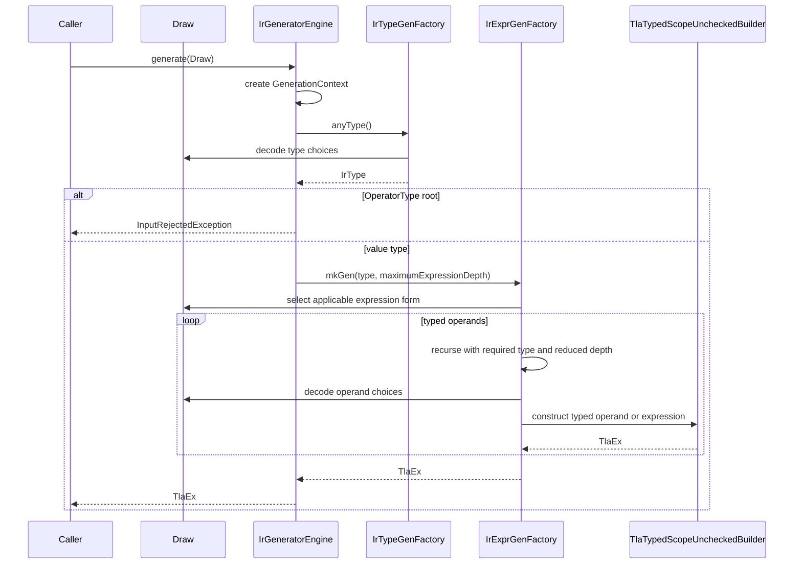

# IR generator architecture

**Status:** Description of the implemented design

## 1. Purpose and scope

The packages `io.github.tlaplus.hardening.gen` and
`io.github.tlaplus.hardening.gen.engine` implement deterministic decoders from
an arbitrary byte array to typed Apalache TLA<sup>+</sup> IR. The decoders favor
well-formed output from short inputs and remain useful under byte-level
mutation.

There are two entry points, and an `InputKind` names which one a byte array
belongs to:

- `IrGenerators.expressions` produces a single `TlaEx`.
- `IrGenerators.specs` produces a `GeneratedSpec`: the state variables,
  auxiliary and action operator definitions, initial-state predicate,
  next-state action, invariant and bound predicate of one module.

Both accept an immutable prepared custom-operator library. With a nonempty
library, their output may reference its exported operators; the workflow linker
closes those references before rendering. Neither loads source files or invokes
a typechecker. Section 11 specifies this extension.

Neither produces a `TlaModule`. The surrounding skeleton names the entry points
that the tool invocations spell, so that contract lives beside those invocations
in `workflow.spec.FuzzInputModule` rather than here. Neither runs a random
search, maintains a corpus, or shrinks failing inputs. The
[fuzzing workflow](fuzzing-workflows.md) supplies byte arrays and decides how to
store or mutate them.

The two encodings are independent and share no bytes. Adding a module form
cannot reinterpret a stored expression input, and the reverse holds too.

The design has six primary requirements:

1. The same configuration and bytes produce the same IR or rejection.
2. Exhausted input produces small defaults instead of failing.
3. Local byte mutations should not unnecessarily perturb later decoding; in a
   module, a mutation inside one top-level body's section does not shift the
   bytes any other body decodes.
4. Successful generation returns a value-typed expression accepted by Apalache's
   type-safe, scope-unchecked builder; a generated module additionally
   determines its initial states and every successor state completely.
5. Configuration can exclude expression categories before byte-level selection.
6. Explicit limits bound recursive construction and variable-size payloads.

## 2. Package structure

The package `io.github.tlaplus.hardening.gen` defines the public generator framework and the
IR-generator facade.

| Type | Responsibility |
| --- | --- |
| `Generator<T>` | Deferred recipe that consumes a shared `Draw` and produces one value. |
| `Draw` | Forward-only cursor over the input bytes and the primitive decoding protocol. |
| `BasicGenerators` | Combinators for constants, choices, bounded numbers, lists, and byte arrays. |
| `InputRejectedException` | Expected rejection of one semantically unsuitable input. |
| `ExpressionCategory` | User-facing syntax capabilities assigned to expression forms and structural types. |
| `IrGenerationConfig` | Category exclusions, resource limits, selection weights keyed by `ExpressionKind`, and the prepared `OperatorLibrary`. |
| `IrGenerators` | Public factory for reusable expression and module generators. |
| `ExpressionLimits`, `ModuleLimits`, and `ActionLimits` | Bounds on expressions, module declarations and exploration, and action construction; `ModuleLimits` contains `ActionLimits`. |
| `GeneratedSpec` | The declarations of one generated module, and the exploration depth it asks for. |
| `GeneratedOperator` | One canonical definition: a state-free auxiliary or a `GeneratedActionOperator` with an immutable `ActionEffect`. |
| `InputKind` | Which decoder a byte array belongs to: `expr` or `module`. |

The package `io.github.tlaplus.hardening.gen.engine` implements type-directed IR
construction. Most engine types are package-private. `IrGeneratorEngine` is
public so callers that already own a `Draw` may invoke the coordinator directly.

| Component | Responsibility |
| --- | --- |
| `IrGeneratorEngine` | Creates per-run state, then draws the result type and expression. |
| `IrSpecGeneratorEngine` | Creates per-run state, then draws a module's variables, definitions, and predicates. |
| `ActionGenFactory` | Assembles Init, action definitions, bounded parameters, guards, Next disjuncts and the unconditional step update. |
| `ActionShapeGenFactory` | Decodes recursive shapes, partitions effects, builds assignments and `UNCHANGED`, and applies explicitly visible action operators. |
| `VisibleActionOperators` | Immutable effect index over an explicit declaration-order operator prefix, preserving candidate order. |
| `ModuleSection` | Divides a module input into the contiguous byte sections its top-level bodies decode from. |
| `GenerationContext` | Owns the type-safe builder, lexical scope, fresh-name supplies, node budget, and immutable configuration for one run. |
| `IrType` and `IrTypeGenFactory` | Represent and generate enabled internal types used to direct construction, including the scope-directed type of a read and definition signatures. |
| `ExpressionKind` | Selectable form with category, applicability, and weight policy. |
| `ExpressionKindCatalog` | Standard catalog followed by configured custom kinds, in byte-decoder order. |
| `CustomExpressionKind` | Matches an exported type scheme against a requested result type. |
| `TypeInstantiation`, `ImportedTypes` | Plan bounded type-variable instantiations and convert concrete imported types to private generator types. |
| `IrExprGenFactory` | Filters applicable forms, selects one, enforces expression budgets, and dispatches to a family factory; builds custom applications itself, caching one type plan per operator and requested type. |
| `*ExprGenFactory` | Construct general, Boolean, integer, set, sequence, applicative, and remaining typed forms. |
| `NameScope` | Tracks typed lexical bindings with shadowing and exception-safe restoration, and the binders a label must declare. |
| `BuilderArrays` | Adapts typed lists to Apalache's generic varargs APIs. |

## 3. Generation protocol

The methods `IrGenerators.expressions(config)` and `IrGenerators.specs(config)`
capture immutable configuration and return reusable generators backed by
`IrGeneratorEngine` and `IrSpecGeneratorEngine`. Each invocation creates a new
`GenerationContext`; no builder, scope, counter, or name supply crosses run
boundaries. Section 10 describes the module protocol; the rest of this section
and sections 4 to 8 describe expression generation, which module generation
draws every subexpression through.



The engine first generates an `IrType`. It rejects an operator type at the root;
otherwise, it requests an expression of exactly that value type. Each expression
form determines the types of its operands. For example, equality first generates
one value type and then generates two operands of that type. A set filter
generates its source element type, introduces a binding of that type, and
generates a Boolean predicate in the extended scope.

Factory methods such as `mkGen`, `expression`, `listOf`, and `oneOf` return
deferred `Generator<TlaEx>` computations. Creating a generator must not consume
bytes, increment the node counter, allocate fresh names, or invoke the builder.
These effects occur only when a caller invokes the returned generator with a
`Draw`. Builder calls then return eager `TlaEx` values; there is no final build
step. This invariant permits ordinary `Generator.map` and `Generator.flatMap`
composition without hidden cursors or random sources.

## 4. Byte decoding

All nested generators share one mutable `Draw`. The cursor is neither copied nor
reset during composition. An expression generator may leave an unused suffix.

The one exception is a module's top-level bodies (section 9.1). `ModuleSection`
divides the whole input into contiguous sections by fixed weights, and each body
decodes from its own `Draw.slice`, so a module consumes every byte. Each section
receives the floor of its proportional share; the last also receives the
remainder. The layout order and weights are part of the byte encoding and
`ModuleSectionTest` pins them. Sectioning isolates bytes, not generator state:
fresh-name counters and terminal rotation still run through the whole module in
draw order.

**Decoder deviation (sectioned module input).** This revises the earlier
protocol, in which one cursor ran through every module body in turn. Measured over
a 200,000-entry property-based corpus whose median input was 218 bytes, the
invariant, drawn first, consumed the input before `Init` and `Next` were
reached: two thirds of the modules had a `Next` whose every disjunct only
stuttered, and `Next` applied an action operator in one module in a hundred. The
change reinterprets every stored `module` input.

The primitive mappings are:

- A byte is interpreted as an unsigned integer in `0..255`.
- A Boolean uses the low bit: even is false and odd is true.
- A bounded `long` consumes the minimum whole number of bytes required for the
  inclusive range. It interprets them in big-endian order and applies unsigned
  modulo reduction.
- A choice draws a bounded index and selects the corresponding list element.
- A fixed-width index consumes a byte count chosen by the caller rather than one
  derived from the number of alternatives, and reduces the big-endian value
  modulo that number.
- Once the input is exhausted, byte reads return zero without advancing the
  cursor. Choices consequently prefer their first alternative.

Modulo reduction introduces the minimum possible imbalance for a fixed byte
width: each alternative receives either the floor or ceiling of the available
byte patterns divided by the number of alternatives. The decoder does not use
rejection sampling because variable retry counts would shift the interpretation
of all subsequent bytes.

A derived width has the same defect whenever the number of alternatives is not
fixed by the format. Expression-form selection is such a case: how many forms
apply depends on the requested type and on the current lexical scope, so a width
derived from that count would change how many bytes one choice costs, reframing
every byte after it for a reason unrelated to the choice. Form selection
therefore uses a fixed-width index.

Variable-size values use continuation markers rather than length prefixes.
`BasicGenerators.listOf` and `byteArray` first generate their mandatory elements.
Before each optional element, they read one Boolean marker: odd continues and
even terminates. Reaching the configured maximum consumes no additional marker.
This layout avoids a dedicated size byte whose mutation could add or remove many
elements at once.

The byte encoding is implementation-local. Enum declaration order, expression
catalog order, or generator composition changes may reinterpret an existing
input. The corpus therefore preserves the raw generator bytes in the CBOR
`input` field, but the project does not yet promise cross-version decoding
compatibility.

## 5. Type-directed construction

The sealed `IrType` model covers Boolean, integer, string, model-value, set,
sequence, function, tuple, record, variant, and operator types. Each type converts
to an Apalache `TlaType1`. Keeping this model separate from the builder types
makes recursive matching and Java pattern matching explicit.

The method `IrTypeGenFactory.anyType()` decodes both value and operator types.
The engine deliberately retains this complete root catalog so rejecting an
operator-typed root does not reinterpret byte strings that already select value
types. A decoded `OperatorType` root raises `InputRejectedException` before
expression construction because TLA+ operators are not values. The method
`valueType()` excludes operator types and is used for operands and collection
elements. The method `parameterTypes()` draws a definition's signature: a
terminated, possibly empty list whose elements are value types or, while the
`operator` category is enabled, first-order operator types with at least one
argument, such as the type of `F(_, _)`. `LET` declarations, auxiliary operators
and action operators all draw their signatures there, so each may be
higher-order. An operator type is therefore requested wherever an operator
parameter receives its argument, as well as where a construct itself requires
one, such as a fold; `LAMBDA`, a visible operator of that exact type through
`NAME`, and the lambda terminal supply it. Nested type generation carries a
remaining-depth budget. At zero, it selects only enabled primitive or
model-value types. Tuples, records, and variants use terminated nonempty
component lists; operator argument lists may be empty.

Structural categories filter the type catalog at every recursive type request.
For example, ignoring `record` removes every record type, including records
nested in sets or tuples. Function types require both `function` and `set`
because every closed function value needs a set-valued domain. Boolean, integer,
and string types remain available through the reserved `core` category.

Expression kinds are grouped by construction responsibility:

- `GeneralExprGenFactory` handles terminals, names, conditionals, `CHOOSE`,
  `CASE`, applications, `LET`, prime, folds, sequence head, and variant access.
- `BooleanExprGenFactory` handles propositional, relational, quantified, action,
  temporal, and fairness expressions, and the `TemporalActionExpressionKind`
  family: `[]<><<A>>_v` and `<>[][A]_v`.
- `IntegerExprGenFactory` handles integer literals, arithmetic, cardinality, and
  sequence length.
- `SetExprGenFactory` handles set literals and operators, comprehensions,
  mappings, products, predefined sets, powersets, domains, and variant filters.
- `SequenceExprGenFactory` handles sequence literals and sequence operators.
- `OtherExprGenFactory` handles strings, model values, functions, updates,
  tuples, records, variants, and lambdas.
- `ApplicativeExprGenFactory` handles reads, `EXCEPT` updates and domains of
  records, tuples and sequences, the values TLA+ applies like functions and that
  Apalache's builder calls applicative. Each `ApplicativeExpressionKind` pairs an
  `ApplicativeType`, which carries the facts that differ between the three, with
  one of those operations. Functions keep their own forms in the families above.

`IrTypeGenFactory` also makes the type choices of the read forms (section 7),
which consult lexical scope as well as the type catalog. A `LET` declares a terminated, non-empty list of local operators.
Each draws its parameter types and then one Boolean: even keeps the `LET`'s own
type as its result, odd draws a value type. Its body sees its parameters and the
declarations before it, but not itself, so no declaration is recursive; the
`LET` body sees them all.

The grouping is an implementation decomposition, not a TLA<sup>+</sup> language
taxonomy.

**Operators not generated.** The decoder emits no form for the following, which
the modules a generated specification extends define:

- `SelectSeq`, `FunAsSeq` and recursive function definitions exist in the
  Apalache IR, but `TlaTypedScopeUncheckedBuilder` exposes no method for them.
- TLC's `:>` and `@@` are definitions in `TLC.tla`, not IR operators.
- `RECURSIVE` operators, which Apalache does not support.
- The builder supports these `Apalache.tla` operators, but they are not
  generated. `Guess` is nondeterministic in Apalache and a `CHOOSE` in TLC, and
  `Gen` erases to an ill-typed `{}` under TLC, so either would report a verdict
  difference that is not a defect. `Skolem`, `ConstCardinality` and `SetAsFun`
  are sound only under preconditions the decoder does not establish: an
  existential or cardinality bound in a position Apalache honors, and a set of
  pairs with distinct keys. `MkSeq`, `Repeat`, `Expand` and `:=` carry no such
  obstacle.

Every expression kind has one primary `ExpressionCategory`:

| Category | Expression forms |
| --- | --- |
| `action` | Prime, prime-equality, and `UNCHANGED` |
| `temporal` | Stuttering and non-stuttering actions, `ENABLED`, `[]`, `<>`, `~>`, `[]<><<A>>_v`, `<>[][A]_v`, and weak and strong fairness |
| `unbound` | Unbounded `CHOOSE`, universal quantification, and existential quantification |
| `exotic` | Temporal quantification, action composition (`\cdot`), and `-+->` |
| `core` | Terminal construction, scoped names, and Boolean, integer, and string literals |
| `control` | `IF` and `CASE` |
| `label` | Expression labels |
| `operator` | Operator application, `LET`, and lambdas |
| `quantifier` | Bounded `CHOOSE`, universal quantification, and existential quantification |
| `bool_logic` | Equality, inequality, and Boolean connectives |
| `arithmetic` | Integer arithmetic and comparisons |
| `set` | Membership, subset tests, set literals, ordinary set operations, comprehensions, powerset, and intervals |
| `finite_set` | `Cardinality` and `IsFiniteSet` |
| `universe` | The predefined `BOOLEAN`, `STRING`, `Int`, and `Nat` sets |
| `sequence` | Sequence literals, operations, length, head, indexing, updates, domains, and sequence sets |
| `function` | Function application, construction, updates, function sets, and domains |
| `fold` | Set and sequence folds |
| `tuple` | Tuple literals, projections, updates, domains, and Cartesian products |
| `record` | Record literals, field reads, updates, domains, and record sets |
| `variant` | Variant literals, tags, accessors, and filtering |
| `model` | Model values and parsed model values |

Primary categories are exclusive. A form may additionally require other syntax
capabilities without belonging to those categories. Bounded quantifiers require
`set`; `finite_set` and `universe` operations require `set`; set and sequence
folds require `operator`; and specialized set forms require both `set` and their
primary category. Ignoring a capability disables such dependent forms
transitively. `core` cannot be ignored because it supplies atomic leaves and the
total terminal fallback.

Category exclusion applies to the complete generated expression. The type
filter prevents terminal construction from reintroducing ignored structural
syntax. It does not change the workflow module that embeds the expression; that
module retains its fixed `Next == UNCHANGED exprValue` definition.

For each nonterminal request, `IrExprGenFactory` works from the forms this run
may use for the requested type: those whose requirements are not ignored by the
configuration and whose result type matches. That set depends only on the type,
so it is computed once per type and reused, in catalog order. The factory then
scans it twice, checking only the current weight, which is the one condition that
changes between draws. The first scan sums the slots the applicable forms
occupy, one fixed-width index selects among those slots, and the second scan
dispatches only the selected form. Unavailable forms weigh zero and consume
neither a selection slot nor operand bytes. Selection spends two bytes and
distributes their 65536 values as evenly as possible, so the catalog plus the
slots configured weights add must fit in 65536. The width is fixed rather than
derived from the slot total, for the reason given in section 4.

A form occupies as many slots as its weight, so a weight of `n` makes it `n`
times as likely as an unweighted form applicable to the same request. Uniform
selection spends the same probability on a form that consumes the surrounding
lexical context as on any other, which leaves a generated lambda rarely
mentioning its parameters and a membership test rarely testing against a
non-empty literal. Such an expression is well-formed but exercises nothing a
model checker has to work for. Every `ExpressionKind` supplies its configuration
name and selection weight; no parallel configuration enum exists.

`TERMINAL` takes a configured weight only while a binding of the requested type
is visible, because that is the case where it contributes a name. It applies to
every type, so weighting its closed-constant case would shrink every expression
rather than bias towards the surrounding context.

A request with exactly one applicable form is dispatched without a draw, since
nothing is being chosen. That case does not arise today — an enabled type always
offers the terminal form plus at least one enabled constructor — and
`ExpressionKindCatalogTest` pins that property, so selection costs the same two bytes
everywhere.

## 6. Termination and resource limits

Expression generation switches to a terminal expression when any of these
conditions holds:

- no expression depth remains;
- the expression-request counter reaches `maximumNodes`; or
- the input cursor is exhausted.

The counter lives on `GenerationContext`, which can scope a fresh budget around
a generator. The expression entry point scopes one budget around its whole run.
Module generation scopes one per top-level body and per action disjunct: a
budget spanning several independent bodies would let an early one decide how
much is left for a later one, and a large `Init` would starve `Inv` into a
constant. Byte sections (section 4) make the same separation for the input
itself.

Within one action disjunct the recursive action shape (section 9.2) also
consumes this counter and observes `maximumActionDepth`. It falls back to a leaf
when the depth reaches zero, the per-disjunct budget is spent, or the input is
exhausted, mirroring the expression fallback above.

Terminal construction is byte-free. When bindings of exactly the requested type are
lexically visible, successive terminals rotate over them, innermost first, and then
the closed terminal. Otherwise every `IrType` has a closed terminal expression:
`FALSE`, zero, the empty string, empty sets and sequences, componentwise terminal
tuples and records, an empty-domain function, and a lambda for an operator type.
Operator types always take the lambda terminal, because an operator name is not a
value; a visible operator reaches an operator argument through `NAME` instead. An
empty input therefore selects Boolean as its root type and produces `FALSE`.

Using a visible name matters because terminals are the most common leaf: with a
closed-constant-only terminal, a starved lambda body, quantifier body, or
comprehension ignores the name it just introduced, and constructs whose meaning
depends on that name degenerate. Measured over property-based inputs, 3-9% of
generated fold lambdas referenced any of their own parameters before this rule and
about 81% after it.

Rotating, rather than always taking the innermost match, is what keeps that from
overshooting. Returning one name unconditionally makes every starved leaf of a type
in a scope the same name, so same-type sibling leaves collapse into tautologies such
as `x = x` and `x \in {x}`, which a model checker folds away before reaching
anything worth testing. Rotation halves that: measured on singleton membership tests
whose left side is a fold parameter, tautologies fell from 30 of 50 to 19 of 45.

The rotation position is kept per type rather than in one counter, because a terminal
of an unrelated type would otherwise shift the phase between two same-type siblings
and reinstate the collapse about half the time. It advances only when a binding is
visible, and it is generator state rather than input, so terminal construction stays
byte-free and deterministic. Byte-freeness is not incidental here: terminals are the
exhaustion fallback, and exhausted reads return zero forever, so spending a byte on
the choice would decode as one fixed position exactly where diversity is wanted.

The node limit counts recursive expression-generation requests, not final IR
nodes or builder operations. Terminal construction can itself contain several IR
nodes when the requested type is composite. Because these bounds are on structure
rather than rendered size, they do not by themselves keep a module's source under
the worker request frame limit; the workflow's input stage renders each admitted
candidate and rejects one that would not fit (see
[fuzzing-workflows.md](fuzzing-workflows.md)). This is a workflow admission
policy, not a generator limit: the decoders stay deterministic byte-to-IR
mappings.

The counter is global to one run and is consumed in pre-order, so operands drawn
later in a construct are the ones that fall back to terminals. `maximumNodes` must
therefore stay above the point where a construct's last operand is routinely
starved; below it, the constructs whose meaning lives in that position degenerate,
such as a fold's collection or the right-hand side of membership. Raising
`maximumNodes` from 32 to 128 moved folds over a non-empty collection literal from
10% to 85% of property-based inputs, at 1.6x the Apalache checking time per input.
Raising it further is not worthwhile: at 256 the precursor rate roughly doubles
again but checking time per input grows by more than an order of magnitude,
because a few very large expressions dominate it.

The default configuration ignores these four categories:

```toml
ignore = ["action", "temporal", "unbound", "exotic"]
```

An empty list enables every excludable category. The reserved `core` category is
always enabled. The default limits are:

`ExpressionLimits` bounds one expression:

| Limit | Default | Meaning |
| --- | ---: | --- |
| `maximumTypeDepth` | 3 | Maximum nesting depth of generated types. |
| `maximumExpressionDepth` | 32 | Maximum recursive expression depth. |
| `maximumNodes` | 128 | Maximum nonterminal expression requests per top-level body. |
| `maximumCollectionSize` | 8 | Maximum generated elements in a variable-size collection. |
| `maximumStringBytes` | 32 | Maximum byte payload mapped into a string literal. |
| `maximumIntegerBytes` | 16 | Maximum two's-complement payload for an integer literal. |

`ModuleLimits` bounds declarations and exploration and contains an `ActionLimits`
value for the four action-specific limits. TOML keys and defaults are unchanged:

| Limit | Default | Meaning |
| --- | ---: | --- |
| `maximumVariables` | 3 | Maximum declared state variables, excluding the step counter. |
| `maximumAuxiliaryOperators` | 2 | Maximum state-free operator definitions the predicates may apply. |
| `maximumActionOperators` | 2 | Maximum action operator definitions `Next` may apply; each reads current state and primes its effect set. |
| `maximumActions` | 3 | Maximum disjuncts of the next-state action. |
| `maximumActionParameters` | 2 | Maximum bounded existential parameters of one action. |
| `maximumActionDepth` | 3 | Maximum nesting of disjunction, conjunction, and IF-THEN-ELSE within one action disjunct; 0 keeps each disjunct a flat conjunction. |
| `maximumSteps` | 5 | Transitions explored from an initial state. |
| `maximumFairnessConditions` | 2 | Maximum weak and strong fairness conditions of a property. |

Selection weights default to one, except:

```toml
weights = { name = 8, enum_set = 16 }
```

These come from sweeping each weight against how often an admitted input contains
a membership test on a fold parameter against a non-empty set literal. The set
literal dominates: raising its weight from 1 to 16 took that shape from 148 to
1168 per 20000 admitted inputs, while the same sweep over the name weight barely
moved it. A weighted terminal measured slightly worse than none, because it
crowds out the literals that would otherwise be the other side of a comparison.

## 7. Names and lexical scope

The expression entry point starts with an empty lexical scope. It never invents a
free name reference: a custom call names an export from its explicit prepared
library, and other references must be lexically bound. Quantifiers, set comprehensions, function definitions, lambdas,
and local operators extend the scope only while generating their lexical bodies.
`NameScope`, rather than Apalache's builder, is the authority for lexical
visibility.

`NameScope` stores bindings in a persistent Vavr list. Extending a scope shares
the previous tail, and `try`/`finally` restores the prior head after normal or
exceptional completion. Lookup resolves shadowing by name before filtering by
type or semantic role. Consequently, an inner binding hides an outer binding
even when their types differ.

A `ScopedName` records its exact `IrType` and one of three roles: a binder, a
definition name or formal parameter, or a state variable. General name
expressions select only exact type matches, and the role does not narrow them.
Operator application selects a visible `OperatorType` with the requested result
type, then generates arguments from its declared signature. An operator
parameter is such a binding inside its definition's body, and an argument of
operator type is drawn like any other, so it is a `LAMBDA` or the name of a
visible operator of exactly that type. The IR represents a lambda as a `LET`
whose body names its declaration, which TLA+ does not accept as an argument;
`PrettyWriter` hoists that declaration in front of the application. The role
exists because TLA+ labels distinguish these cases; section 8.1 gives the rule.

A form that reads a value first chooses the value's type. The reads are the
access and domain forms of records, tuples and sequences, function application
and function `DOMAIN`, and the variant tag, accessors and filter. After one
Boolean, spent in either case, an odd marker selects among the reachable types
that suit the read; an even marker, or no such type, draws a fresh one. The
reachable types are those of the visible bindings and, recursively, their
component types, in first-reached order. The suitable and fresh types are:

| Read | Suitable reachable type | Fresh type |
| --- | --- | --- |
| Record, tuple or sequence access | one of that kind holding the requested component | the requested component among drawn ones |
| Record, tuple or sequence domain | any of that kind | a drawn component among drawn ones |
| Function application | a function with the requested result | a drawn argument type |
| Function `DOMAIN` | a function with the requested argument | a drawn result type |
| `VariantGetUnsafe`, `VariantGetOrElse`, `VariantFilter` | a variant with a tag carrying the requested payload | fresh tags, the payload among drawn alternatives |
| `VariantTag` | any variant | fresh tags over drawn alternatives |

Record field names and variant tags are fresh for every drawn type, so a fresh
record or variant would never be the type of a visible name, and a read of it
would always eliminate a literal built on the spot; a drawn function type matches
a visible one only by chance. Where several record fields, tuple positions or
variant tags hold the requested type, a choice selects among them. The read value
is then drawn at that type like any other operand, so `NAME` and terminal rotation
can supply a state variable, a parameter or a bound name. A sequence index is an
arbitrary integer expression and, like `Head`, may lie outside the sequence's
domain; a variant read at a tag the value does not carry is likewise partial.

**Decoder deviation (reads from scope and higher-order definitions).** Function
application, function `DOMAIN` and the four variant forms used to draw the read
type fresh; a variant read drew a single-tag variant, which no binding could
have, so a variant-typed state variable was never inspected. They now spend the
Boolean and the choices above. A `LET` used to declare one nullary operator of
its own type, and every signature drew only value parameters, so no generated
expression passed an operator and the selectable `LAMBDA` form was unreachable.
This reinterprets every stored input, of either kind, that reaches these forms,
and every stored `module` input whose auxiliary or action section declares an
operator. The change makes these reads of names reachable, not common: over 5,000
module inputs under the default configuration, 0.15% of variant reads and 0.11%
of function applications apply a name, against none before, while record and
tuple reads, which already chose their type this way, measure about 0.2%.

Alongside the visible bindings, `NameScope` keeps the binders that a label
generated at the current point must declare. `withDefinitionBoundary` empties
that second list for the duration of a nested definition body while leaving
lexical visibility untouched, and restores it the same way.

Applicability is partly dynamic. `NAME` and operator application are excluded
from selection when no compatible binding exists, and `PRIME_EQUAL` when no state
variable is in scope.

### 7.1. Levels

Categories say which forms a corpus may use; levels say where a form may occur.
[ADR 0007](../decisions/0007-levels-and-temporal-properties.md) records the
design and the TLC and Apalache measurements it rests on.

Every `ExpressionKind` declares the `Level` of the formula it builds: `STATE`
(the default, including `ENABLED`), `ACTION` (prime, `PRIME_EQUAL`, `UNCHANGED`,
`[A]_v`, `<<A>>_v`, `\cdot`), `TEMPORAL` (`[]`, `<>`, `~>`, `-+->`, `\EE`, `\AA`),
or `ACTION_TEMPORAL` (`WF`, `SF`, `[]<><<A>>_v`, `<>[][A]_v`). `GenerationContext`
keeps a `LevelContext` as a dynamic ceiling, restored on exit like the
`EXCEPT`-replacement flag, and `IrExprGenFactory` gives a form weight zero unless
the current context admits its level. Like the scope, the context is consulted on
every draw rather than cached with type applicability.

| `LevelContext` | Admits | Used for |
| --- | --- | --- |
| `STATE` | `STATE` | every body not listed below |
| `ACTION` | `STATE`, `ACTION` | post-assignment guards; the action of `ENABLED`, `[A]_v`, `<<A>>_v`, fairness and the action-temporal forms |
| `TEMPORAL` | `STATE`, `TEMPORAL`, `ACTION_TEMPORAL` | the property formula |
| `ACTION_FREE_TEMPORAL` | `STATE`, `TEMPORAL` | operands of `[]`, `<>`, `~>` and `-+->` |

Operands inherit the context by three rules:

- `AbstractExprGenFactory.expression` draws an ordinary operand in
  `LevelContext.valueOperand()`: a temporal context becomes `STATE`, and `ACTION`
  stays `ACTION`, so `x' + 1` remains reachable. Quantifier bodies, predicates,
  domains and values are all ordinary operands.
- `sameLevel` keeps the context. Only `~`, `/\`, `\/`, `=>`, the branches of
  `IF`, the body of `LET` and labels use it. TLC cannot handle a temporal formula
  under `<=>` ([tlaplus/tlaplus#1029](https://github.com/tlaplus/tlaplus/issues/1029)) or in a `CASE` arm, and Apalache
  crashes on a quantifier over one.
- `atLevel` names the context explicitly: `STATE` for the operand of prime and
  `UNCHANGED`, for subscripts, for `LET` declaration and lambda bodies and for
  operator arguments, so every name in scope is state-level; `ACTION` for the
  action of the subscripted and fairness forms and of `ENABLED`;
  `ACTION_FREE_TEMPORAL` for the operands of `[]`, `<>`, `~>` and `-+->`. TLC
  checks an action inside a temporal formula only in `[]<>A` and `<>[]A` separated
  from the top of the formula by Boolean connectives alone.

`[][A]_v` is not an expression form: both checkers accept it only as a top-level
conjunct of a property, so `PropertyGenFactory` draws it (section 9.4). Every
body of a module and the expression entry point starts in `STATE`, which is what
keeps priming out of every ordinary subexpression whatever the ignore list.

## 8. Correctness and failure semantics

Factories construct eager `TlaEx` values exclusively through one
`TlaTypedScopeUncheckedBuilder` in its strict default mode. The builder enforces
operator requirements and type correctness but deliberately skips lexical-scope
checking. `NameScope` enforces lexical visibility before a name or operator can
be selected. This avoids the scoped builder's recursively composed instruction
chain while retaining Apalache's type checks for the linked version.

This guarantee is deliberately narrow. It does not establish semantic
definedness, temporal-level correctness in a surrounding module, or usefulness
to a model checker. Operations such as division, sequence head, and unsafe
variant access may still receive values for which evaluation is partial.

A generated module carries two further guarantees, stated in section 9: its
initial-state predicate constrains every declared variable, and every disjunct
of its next-state action accounts for every declared variable exactly once.

A generated module is also meant to parse. `ParserProcessTest` asserts this
against SANY, without exception, on a fixed sample under the shipped
configuration. The one known way to break it is not a decoder defect:
[`apalache-printer-009`](../../findings/apalache-printer/apalache-printer-009.md)
renders a nested `CASE` as a `CASE` arm body without delimiters, so a later arm
is absorbed into an enclosing `CHOOSE`'s scope and SANY reads a different tree
than the IR. That shape is reachable under the shipped configuration: before
module inputs were sectioned, a 100-entry
`fuzztla run --how=pbt --seed=7921605275006395529` produced one such entry. Until `PrettyWriter` delimits the nested `CASE`, such an entry fails the
parser. The integration workflow therefore accepts parser failures.

### 8.1. Label formal parameters

TLA+ requires an expression label to declare exactly the identifiers introduced
by expression-level binders whose scope contains it. SANY reports a missing one
as "must contain formal parameter" and an extra one as "declares extra
parameter(s)"; the order of the list is irrelevant. Emitting labels without
parameters rejected 58% of a module-kind corpus at the parser, so this is a
decoder obligation rather than a caller's.

`ScopedNameKind` records which of the three roles a visible name has, and only
`BINDER` contributes a label parameter. A quantifier, `CHOOSE`, function
constructor, set filter and set map introduce binders. A definition's name and
its formal parameters do not, and neither does a declared state variable.

Three constructs end a label's scope, because each is a definition in the source
SANY sees:

- a `LET` declaration body,
- a lambda body, since `PrettyWriterWithAnnotations` renders a lambda as a named
  `LET` definition and the builder already produces one,
- a label's own body, whose parameters become that definition's parameters.

`NameScope` therefore keeps the visible binders in a second list that
`withDefinitionBoundary` empties for the duration of a nested definition body,
leaving lexical visibility untouched: such a body may still refer to an
enclosing binder even though a label in it may not name one.

A bound name's domain is outside that name's scope, so a label there declares
nothing for it. Where several binders nest, each domain does sit inside the
scope of the binders drawn before it, and the generator draws it there, so that
the tree's lexical structure matches the rendered source's. One construct that
binds several names, `[x \in S, y \in T |-> e]` or `{e : x \in S, y \in T}`,
is different: every domain lies outside all of its names, so the generator draws
all domains before any of them enters scope, and only the body declares them.
A set map binds a terminated, non-empty list of names; a function constructor
whose argument is a tuple of two or more components spends one Boolean choosing
between one name per component and a single tuple-valued name.

Labels withdraw inside an `EXCEPT` replacement expression, at any depth. SANY
rejects every label there with "Labels inside EXCEPT clauses are not yet
implemented", recorded as `findings/SANY/sany-002.md`, so generating one only
rediscovers a filed restriction at the cost of the whole module. An index and
the updated function itself are unaffected.

`InputRejectedException` denotes an expected dead end for the current bytes,
such as decoding an operator type at the expression root or selecting a
state-variable-dependent form without a state variable. A fuzzing driver may
discard that input. Exhaustion and budget fallback are not rejections. Other
runtime exceptions, builder failures, and violated invariants indicate defects
or dependency incompatibilities and must propagate.

Both engines are reusable and safe for concurrent calls with distinct `Draw`
instances because every call creates its own mutable context. `Draw` itself is
not thread-safe and retains, rather than copies, its input array. The caller
must not mutate that array during generation.

## 9. Module generation

`IrSpecGeneratorEngine` decodes a `GeneratedSpec`. Its output is admissible to
the parser and to both model checkers, which requires more than type
correctness: a checker rejects a module that names something it does not
declare, that does not determine its initial states, or that leaves a variable
unspecified in a successor state. These are invariants of construction, not
properties of the input — no byte string can violate them.

### 9.1. Declaration order

Each numbered body below decodes from the `ModuleSection` of the same name, in
this order; the section weights are `1, 2, 3, 3, 2, 5, 3` in the order listed. The
property section is present only when the `temporal` category is enabled; an
absent section receives no bytes, so the other sections keep the layout they had
before it existed.

1. **Variables.** A terminated non-empty list of value types, named `var0`
   onward, each entering the scope with the `STATE_VARIABLE` role. An `Int`
   step counter named `step` is appended unconditionally.
2. **Auxiliary operators.** A terminated list of definitions named `Op<N>`,
   each with a signature from `parameterTypes()` (section 5), so a parameter may
   be an operator. Each body sees the definitions before it and its own
   parameters, but no state variable, so definitions are acyclic and in
   declaration order.
3. **Invariant.** One Boolean expression over the variables, which may apply
   the auxiliary operators.
4. **Action operators.** A terminated list of definitions named `Act<N>`. Each
   body is a recursive action shape (section 9.2) over a chosen non-empty subset
   of the declared variables — its *effect* — drawn with the state variables, the
   auxiliary operators, the earlier action operators and its parameters in scope;
   its signature, too, comes from `parameterTypes()`. Unlike an
   auxiliary operator it reads current state and primes, so it is applicable only
   in `Next`, never in `Init` or `Inv`. A later operator may apply an earlier
   one; none mentions `step`. `ActionGenFactory` assembles these definitions using
   `ActionShapeGenFactory` for their bodies.
5. **Initial-state predicate.** One conjunct per declared variable, in
   declaration order, either `v = e` or `v \in S`, plus `step = 0`.
6. **Next-state action.** A terminated non-empty disjunction of actions.
7. **Property.** An optional temporal property with fairness; see
   [9.4](#94-temporal-property).

`GeneratedSpec.operators` stores auxiliary and action variants of the sealed
`GeneratedOperator` abstraction in one declaration-order list. Declaration-only
consumers iterate it without distinguishing variants. Each action's `ActionEffect`
retains distinct variable names in declaration order and has set-style identity;
`GeneratedSpec` rejects effects naming undeclared variables. Completeness is
established by construction and checked by tests, not a second production analyzer.
Internal scope decorators reference the canonical operator and add only its signature.

Before sections, the invariant was drawn first among the bodies, because a
starved Boolean decodes to the closed terminal `FALSE`, which every initial state
violates. That order let the invariant starve every later body instead, and kept
it from applying the auxiliary definitions. With sections, no body's bytes depend
on another's, so the invariant follows the definitions it may apply. The weights
favour `Next`, whose shape and assignments need the most choices, and the
invariant and action operators after it.

Auxiliary definitions are closed over their parameters for a related reason: one
that read a state variable could not be applied in `Init`, where no variable has
a value yet, so keeping them state-free makes every auxiliary definition
applicable in `Init`, `Next` and `Inv` alike without an ordering analysis. Action
operators make the opposite trade deliberately — they read current state and
prime — which is why they are drawn after `Init` in the visibility order and are
offered only to `Next`. `Init` likewise constrains each variable without reading
another, because a conjunct that read one would depend on an evaluation order the
predicate does not fix.

### 9.2. Action shape

`ActionGenFactory` builds one action as:

- zero or more bounded existential parameters, whose bound sets belong to the
  enclosing scope and whose names are visible to everything inside;
- the byte-free step guard `step < maximumSteps` (section 9.3);
- optional guards, ordinary Boolean state predicates;
- a recursive *action shape* over the declared variables (below);
- `step' = step + 1`; and
- optional *post-assignment guards*, Boolean expressions drawn in the `ACTION`
  context (section 7.1), which may read primed variables.

The parameters are drawn first, then the shape, then the guards and the
post-assignment guards, although the guards precede the shape in the conjunction.
A guard drawn from a short section is merely absent, whereas a shape drawn from
exhausted bytes is always a leaf and never applies an action operator. The
post-assignment guards follow the step update, where the shape has determined
every primed variable on every path, so TLC's left-to-right evaluation and
Apalache's assignment analysis both see the assignments first. With the `action`
category ignored their list is empty and spends no marker.

`ActionShapeGenFactory` constructs the recursive shape. Operator generation passes
an immutable index of the already generated prefix to each body, and Next receives
the completed index explicitly. The factory owns no mutable operator registry;
creating or running another factory method cannot change a shape's visibility.
A call's candidates are the operators whose `ActionEffect` lies within the
requested variables, in declaration order.

The step advance and the guard sit outside the shape, so the shape's only job is
to account for its variables exactly once, however deeply it nests. Define the
*effect* of a shape as the set of variables it accounts for. The shape draws one
of five kinds, in this decoder order, bounded by `maximumActionDepth` and biased
towards the leaf:

- **leaf** — partition the variables into an assigned subset and the rest; emit
  `v' = e` or `v' \in S` per assigned variable and one `UNCHANGED` (a tuple when
  more than one) over the rest; effect is all of them;
- **call** — apply a visible action operator whose effect lies within the
  variables requested here, drawing its arguments from its signature, and shape
  the requested variables outside that effect recursively as an optional group
  conjoined with the call; effect is the request;
- **conjunction** — split the variables into two non-empty groups and shape each
  recursively; the two conjunct lists are spliced flat; effect is the union;
- **disjunction** — two arms, each shaping the *same* variables recursively;
- **IF-THEN-ELSE** — an ordinary current-state Boolean predicate and two
  branches, each shaping the same variables recursively.

The markers are geometric, so the call comes second. Last in that order, it was
decoded for one shape in sixteen.

Recursion falls back to a leaf at zero depth, a spent node budget, or exhausted
input, and a call falls back to a leaf when no operator's effect lies within the
request. The leaf on the conjunction spine assigns at least one of its variables,
so no complete branch is a pure stuttering step that the checkers explore without
learning anything. When every assignment of that leaf decodes to the syntactic
identity `v' = v` — terminal rotation names the assigned variable itself as often
as not — the first one takes the type's closed terminal instead. Both repairs are
byte-free, so they stay out of the encoding. A non-spine conjunction group, and
the remainder beside a call, may be left entirely `UNCHANGED`.

The invariant a test can check is that in every disjunct the conjunctive spine,
cut after the step update —
with each nested disjunction and IF-THEN-ELSE collapsed to the variable set its
arms share, and each call resolved to its operator's effect by recursing into the
applied body — accounts for each declared variable exactly once (primed on the
left of an assignment, or inside an `UNCHANGED`), and that sibling arms and
branches account for the same set. What makes it checkable is that the accounting
is assembled here, over the declaration list, and that the effect of every action
operator is recorded. This is why only `ActionGenFactory` (the step update) and
`ActionShapeGenFactory` (recursive bodies) prime names or build `UNCHANGED` on the
spine, and why every module subexpression before the step update — the
IF-THEN-ELSE predicate included — is drawn in the `STATE` context: a prime reached
through an expression form could sit under a negation or a quantifier, where it
accounts for nothing. The step update is a fixed conjunct, which is how a reader
of the IR tells the spine from the post-assignment guards.

**Decoder deviation (levels, ADR 0007).** Module generation used to ignore the
`action`, `temporal` and `exotic` categories in every subexpression whatever the
corpus configured; the `STATE` context now does that job. Each disjunct gained the
step guard and, with `action` enabled, the post-assignment guards. With the
default ignore list the guards spend no byte, so stored `module` inputs decode to
the same shapes plus the step guard; with `action` enabled they reinterpret.

**Historical decoder deviation (introduction of nested actions).** This weakened the previous invariant — "each declared variable
appears exactly once on a flat conjunctive spine" — to the recursive form above,
and adds a definition kind (action operators, section 9.1) that reads state and
primes, where auxiliary operators do neither. Priming and `UNCHANGED` stayed
confined to action generation; the category exclusion was unchanged. That change
reinterpreted stored `module` corpus inputs, because the partition layout changed,
`step' = step + 1` moved out of it, and a new declaration list was drawn.

**Implementation refactor.** The unified operator model, explicit visibility,
shape-factory extraction and grouped limits do not revise the byte decoder.
Shape kinds are decoded from pinned enum order with the same geometric Boolean
markers; fixed-byte tests pin shapes and remaining bytes, including fallbacks.
`AssignmentRequirement` names the recursive non-stuttering obligation described
above. Declaration order, category exclusions and generated behavior are unchanged.

### 9.3. Bounding exploration

A generated action can run forever, and the checkers must explore the same
states and the same infinite behaviors, or a verdict difference records a bound
difference rather than a checker difference. Every generated disjunct is guarded
by `step < maximumSteps` and advances `step`, and `FuzzInputModule` closes the
next-state action with a stuttering disjunct over every variable:
`Next == nextAction \/ UNCHANGED <<var0, ..., step>>`. The reachable states are
those within `maximumSteps` transitions, and TLC needs no state constraint.

The stuttering disjunct matters for properties: TLC adds stuttering steps of its
own, Apalache does not, and without the disjunct Apalache reports
`ExecutionsTooShort` where TLC reports a violation of `<>P`. Because `step` only
increases, every cycle is a stuttering self-loop, so every lasso fits in
`maximumSteps + 1` transitions. `GeneratedSpec.stepBound` travels in a
`CheckRequest`, whose `unrollingLength` is the bound for an invariant and one more
when a property is checked. The expression wrapper asks for zero transitions.

**Decoder deviation (closed bounding, ADR 0007).** Earlier modules had no step
guard; `GeneratedSpec.boundPredicate` became a `Bound` definition that TLC named
as its `CONSTRAINT`, as `step <= maximumSteps - 1` to compensate for TLC evaluating
the invariant on a successor state before discarding it. The guard makes that
offset unnecessary and removes `Bound`. `IrSpecGeneratorsTest` pins the guard
across step bounds, including `0`.

### 9.4. Temporal property

With the `temporal` category enabled, `PropertyGenFactory` decodes the property
section over the state scope: one Boolean marker and, when it is odd, the formula
in the `TEMPORAL` context, a terminated list of at most `maximumFairnessConditions`
fairness conditions (a Boolean chooses `SF` over `WF`), and a terminated list of
`[][A]_v` conjuncts. The formula comes first, so a short section still decodes
one, and each part has a node budget of its own. `GeneratedSpec.property` holds
them as a `TemporalProperty`.

`FuzzInputModule` assembles `Fairness`, `Spec == Init /\ [][Next]_vars /\ Fairness`,
`Prop` as the conjunction of the `[][A]_v` conjuncts and the formula, and
`Liveness == Fairness => Prop`; each is `TRUE`-based when absent, and the
expression wrapper defines them too. TLC checks `SPECIFICATION Spec` with
`PROPERTY Prop`; Apalache, which supports no fairness, checks `--temporal=Liveness`.

## 10. Extension rules

Changes to this subsystem should preserve the following rules:

1. Add a new expression form to the appropriate `ExpressionKind` enum and family
   factory, assigning exactly one primary `ExpressionCategory` and every syntax
   capability it requires. Append the constant: its position in `ExpressionKindCatalog`
   is the byte encoding, and `ExpressionKindCatalogTest` pins the whole order, so
   inserting or reordering a constant reinterprets every stored corpus input and
   fails that test.
2. State result-type constraints in `isTypeApplicable`, the level in `level`,
   and dynamic scope constraints and weight in `selectionWeight`, all on the kind
   itself.
   `IrExprGenFactory` asks the kind; it never names a form. The
   `isConfiguredApplicable` hook combines static applicability with the immutable
   configuration; custom kinds use it to match their library signatures. Only
   `selectionWeight` may consult mutable lexical state, because only it is
   re-evaluated on every draw — the rest of applicability is cached per type. A weight of zero is how a
   form says the current scope cannot supply what it needs.
3. Generate every operand through `expression(requiredType, remainingDepth - 1)`,
   which lowers a temporal context to `STATE`. Use `sameLevel` only for an
   operand through which both checkers accept a temporal formula, and `atLevel`
   for an operand whose level the form fixes (section 7.1).
4. Introduce lexical bindings with `AbstractExprGenFactory.freshBinding` and
   `scopedBody`, which restrict the extended scope to the construct's body, or
   with `boundedTogether` for a construct that binds several names at once. Create
   the binding before any operand that must be drawn ahead of the body: creating
   it consumes no bytes.
5. Use `AbstractExprGenFactory.operands` for a collection of same-typed operands,
   or `BasicGenerators.listOf` or `byteArray` for other variable-size payloads; do
   not introduce length-prefixed collections.
6. Obtain all choices from the supplied `Draw`. Do not add hidden randomness.
7. Provide a closed, byte-free terminal when adding an `IrType` variant. Terminal
   construction consults the lexical scope first and falls back to that closed
   expression, so the fallback must remain byte-free and closed.
8. Reserve `InputRejectedException` for expected input rejection. Let defects
   propagate.
9. Keep the step prime in `ActionGenFactory` and recursive priming and `UNCHANGED`
   in `ActionShapeGenFactory`, including action-operator bodies. Draw every module
   subexpression before the step update in the `STATE` context — the IF-THEN-ELSE
   predicate included — or a disjunct's account of the declared variables stops
   being checkable. Only post-assignment guards and the property leave it.
10. Give a new module-level body a `ModuleSection` and a node budget of its own
    with `GenerationContext.withFreshNodeBudget`. Adding or reweighting a
    section reinterprets every stored module input and fails `ModuleSectionTest`.
11. Request a set type only where one is available. A configuration that ignores
    the `set` category disables set types entirely, so a form that needs one
    must either fall back or consume no bytes deciding not to.
12. Generate an action operator's body with the action shape over its effect
    subset, and record the effect. A call site applies an operator only where a
    visible operator's effect lies within the requested variable set, and shapes
    the rest of the request beside it; the completeness check resolves a call by
    recursing into the applied body, so the effect must stay exact and the
    operators must stay acyclic in declaration order.
13. Choose the type of a value that a form reads with
    `IrTypeGenFactory.readType`, which offers the types reachable from
    scope, rather than drawing it fresh: a type with fresh field names or tags
    never matches a visible name. Draw a new definition's signature with
    `IrTypeGenFactory.parameterTypes`.

Tests should cover category completeness and dependencies, filtered type
generation, byte consumption, exhaustion behavior, deferred execution, catalog
completeness, type applicability, lexical visibility, scope restoration,
terminal construction, determinism, and adversarial inputs. For module
generation they should additionally cover assignment completeness per disjunct
across the recursive action shape — that sibling disjunction arms and IF branches
account for the same variables, that the spine accounts for each declared
variable exactly once, and that each action-operator body accounts for its
declared effect — the absence of primes outside the action and its
post-assignment guards, the level of every body and of generated properties, that
SANY accepts modules with the `action` and `temporal` categories enabled, and that auxiliary
definitions and the initial-state predicate read no state variable. A catalog
change must retain the fixed-width upper bound, update the pinned catalog order,
and explicitly revise the decoding protocol.

## 11. Configured polymorphic operators

**Approved architectural extension.** The catalog is no longer exclusively static,
and generated expressions may be closed over an explicit library rather than only
lexical bindings. The byte decoders remain free of I/O and external processes.
An empty library preserves the existing decoding protocol exactly.

`gen.library.OperatorLibrary` owns a defensive snapshot of imported definitions.
It exposes immutable signatures and returns only fresh declaration copies.
`OperatorId(module, operator)` is the case-sensitive identity; generated names
are injective, identifier-safe encodings in a namespace the decoder never binds.
Rewriting includes all imported binders and references, preserving shadowing.
Only selected exports are candidates. Helpers are retained in dependency order,
but do not acquire selection slots unless explicitly selected.

Each custom kind has the primary category `operator`. Its additional requirements
include the syntax and structural types of its transitive definition closure.
Exclusions therefore cannot be bypassed through a helper body. The importer
rejects unsupported syntax, free constants/state variables, assumptions and
recursive dependencies. Exported and module-helper signatures are first-order:
parameters and results are values, not operators. Local operator definitions and
standard folds may still occur inside their bodies. Type terms may be polymorphic
and may contain open record or variant rows; real, legacy record and sparse-tuple
types are unsupported.

For a requested concrete result type, a custom kind alpha-normalizes its type
scheme and uses the Java facade's `TlaTypeUnifier` and `TlaTypeSubstitution` APIs
to match its result. The unified result must equal the requested type, not merely a
compatible widening. A byte-free feasibility pass checks exclusions, type depth,
collection width and every occurrence of each residual type variable. A selected
call then draws each unresolved value type once. Row variables draw bounded rows,
excluding field names already required by any occurrence of that variable.
Draw order is first structural occurrence in parameters followed by result;
record/variant fields use sorted name order, and row tails follow explicit fields.
Snowcat's variable numbers are not decoder order. Calls do not share substitutions.

Every generated argument and application has a concrete type. Library definitions
retain their generic type tags; the linker does not monomorphize them. Arguments
use the ordinary expression factory at reduced expression depth. Imported body
size is fixed library data, not recursive generation work, and exhaustion still
uses only the existing byte-free terminals.

Custom kinds are appended in configured module/operator order, with one weight per
operator, independently of how many type instantiations it admits. The combined
catalog and weights must fit the existing two-byte selection bound. The value-type
catalog also appends distinct, feasible library result templates, allowing fixed
record fields, variant tags and model-type names to be reached. Instantiating a
template reduces structural depth before recursively drawing its type variables.
With a library configured, every type choice also uses a fixed two-byte index:
filtering templates by depth must not cross a derived byte-width boundary and
reframe subsequent decoding. Without a library, type decoding is unchanged.
Empty record/variant shapes and empty tuple types are not part of this decoder.
A selected, enabled signature with no instantiation within the type limits is a
configuration error.

The workflow links only the used definition closure into each module, once per
import namespace. Importing the same helper through distinct root modules gives
it distinct namespaces. Standalone expression printing closes the same references
with `LET`. Library bodies are excluded from collection-richness scoring, while
the generated applications and their arguments are scored normally. Rendering
admission limits include the linked definitions. Every assembled artifact owns
fresh library IR identities and cannot mutate the prepared snapshot.
