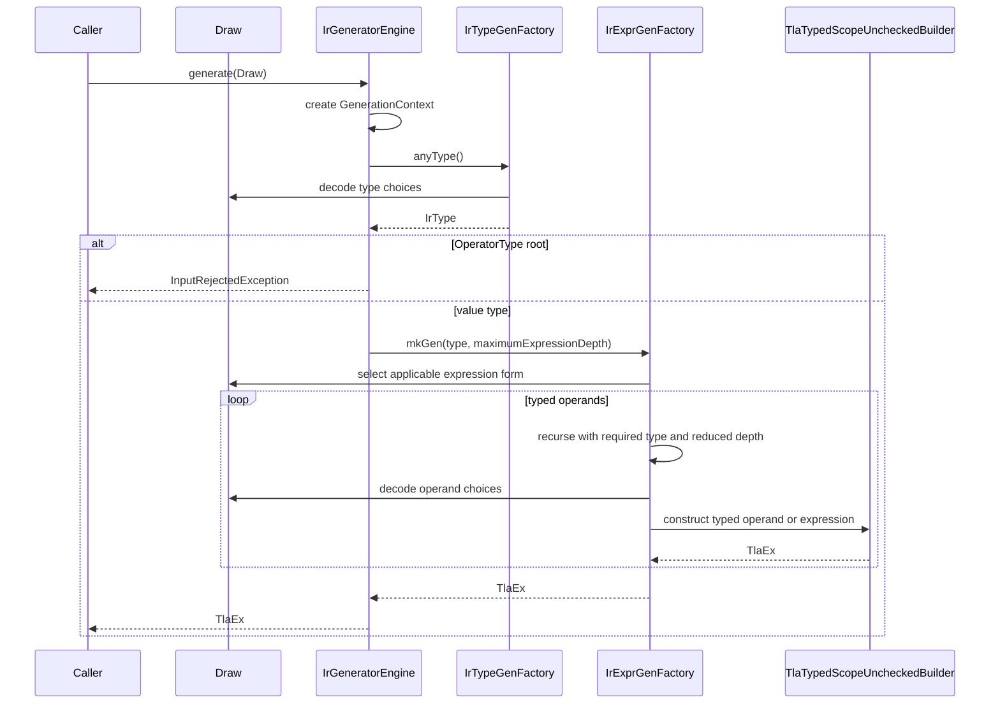

# IR generator architecture

**Author:** OpenAI Codex GPT 5.6-sol max

**Status:** Preliminary description of the implemented design

## 1. Purpose and scope

The packages `io.github.tlaplus.hardening.gen` and
`io.github.tlaplus.hardening.gen.engine` implement a deterministic decoder from
an arbitrary byte array to one typed Apalache TLA<sup>+</sup> IR expression.
The decoder favors well-formed output from short inputs and remains useful under
byte-level mutation.

The generator produces a single `TlaEx`. It does not produce declarations or
modules, run a random search, maintain a corpus, or shrink failing inputs. The
[fuzzing workflow](fuzzing-workflows.md) supplies byte arrays and decides how to
store or mutate them.

The design has six primary requirements:

1. The same configuration and bytes produce the same IR or rejection.
2. Exhausted input produces small defaults instead of failing.
3. Local byte mutations should not unnecessarily perturb later decoding.
4. Successful generation returns a value-typed expression accepted by Apalache's
   type-safe, scope-unchecked builder.
5. Configuration can exclude expression categories before byte-level selection.
6. Explicit limits bound recursive construction and variable-size payloads.

## 2. Package structure

The package `io.github.tlaplus.hardening.gen` defines the public generator framework and the
IR-generator facade.

| Type | Responsibility |
| --- | --- |
| `Generator<T>` | Deferred recipe that consumes a shared `Draw` and produces one value. |
| `Draw` | Forward-only cursor over the input bytes and the primitive decoding protocol. |
| `BasicGenerators` | Combinators for constants, choices, bounded numbers, lists, and byte arrays. |
| `InputRejectedException` | Expected rejection of one semantically unsuitable input. |
| `ExpressionCategory` | User-facing syntax capabilities assigned to expression forms and structural types. |
| `ExpressionForm` | User-facing name of an expression form whose selection weight is configurable. |
| `IrGenerationConfig` | Category exclusions, resource limits, and selection weights for type and expression generation. |
| `IrGenerators` | Public factory for reusable `Generator<TlaEx>` instances. |

The package `io.github.tlaplus.hardening.gen.engine` implements type-directed IR
construction. Most engine types are package-private. `IrGeneratorEngine` is
public so callers that already own a `Draw` may invoke the coordinator directly.

| Component | Responsibility |
| --- | --- |
| `IrGeneratorEngine` | Creates per-run state, then draws the result type and expression. |
| `GenerationContext` | Owns the type-safe builder, lexical scope, fresh-name supplies, and immutable configuration for one run. |
| `IrType` and `IrTypeGenFactory` | Represent and generate enabled internal types used to direct construction. |
| `ExpressionKind` and `ExpressionKinds` | Define the static catalog and byte-decoder order of expression forms. |
| `IrExprGenFactory` | Filters applicable forms, selects one, enforces expression budgets, and dispatches to a family factory. |
| `*ExprGenFactory` | Construct general, Boolean, integer, set, sequence, and remaining typed forms. |
| `NameScope` | Tracks typed lexical bindings with shadowing and exception-safe restoration. |
| `BuilderArrays` | Adapts typed lists to Apalache's generic varargs APIs. |

## 3. Generation protocol

The method `IrGenerators.expressions(config)` captures immutable configuration and returns
a reusable generator backed by `IrGeneratorEngine`. Each invocation creates a
new `GenerationContext`; no builder, scope, counter, or name supply crosses run
boundaries.



The engine first generates an `IrType`. It rejects an operator type at the root;
otherwise, it requests an expression of exactly that value type. Each expression
form determines the types of its operands. For example, equality first generates
one value type and then generates two operands of that type. A set filter
generates its source element type, introduces a binding of that type, and
generates a Boolean predicate in the extended scope.

Factory methods such as `mkGen`, `expression`, `listOf`, and `oneOf` return
deferred `Generator<TlaEx>` computations. Creating a generator must not consume
bytes, increment the node counter, allocate fresh names, or invoke the builder.
These effects occur only when a caller invokes the returned generator with a
`Draw`. Builder calls then return eager `TlaEx` values; there is no final build
step. This invariant permits ordinary `Generator.map` and `Generator.flatMap`
composition without hidden cursors or random sources.

## 4. Byte decoding

All nested generators share one mutable `Draw`. The cursor is neither copied nor
reset during composition. A generator may leave an unused suffix.

The primitive mappings are:

- A byte is interpreted as an unsigned integer in `0..255`.
- A Boolean uses the low bit: even is false and odd is true.
- A bounded `long` consumes the minimum whole number of bytes required for the
  inclusive range. It interprets them in big-endian order and applies unsigned
  modulo reduction.
- A choice draws a bounded index and selects the corresponding list element.
- A fixed-width index consumes a byte count chosen by the caller rather than one
  derived from the number of alternatives, and reduces the big-endian value
  modulo that number.
- Once the input is exhausted, byte reads return zero without advancing the
  cursor. Choices consequently prefer their first alternative.

Modulo reduction introduces the minimum possible imbalance for a fixed byte
width: each alternative receives either the floor or ceiling of the available
byte patterns divided by the number of alternatives. The decoder does not use
rejection sampling because variable retry counts would shift the interpretation
of all subsequent bytes.

A derived width has the same defect whenever the number of alternatives is not
fixed by the format. Expression-form selection is such a case: how many forms
apply depends on the requested type and on the current lexical scope, so a width
derived from that count would change how many bytes one choice costs, reframing
every byte after it for a reason unrelated to the choice. Form selection
therefore uses a fixed-width index.

Variable-size values use continuation markers rather than length prefixes.
`BasicGenerators.listOf` and `byteArray` first generate their mandatory elements.
Before each optional element, they read one Boolean marker: odd continues and
even terminates. Reaching the configured maximum consumes no additional marker.
This layout avoids a dedicated size byte whose mutation could add or remove many
elements at once.

The byte encoding is implementation-local. Enum declaration order, expression
catalog order, or generator composition changes may reinterpret an existing
input. The corpus therefore preserves the raw generator bytes in the CBOR
`input` field, but the project does not yet promise cross-version decoding
compatibility.

## 5. Type-directed construction

The sealed `IrType` model covers Boolean, integer, string, model-value, set,
sequence, function, tuple, record, variant, and operator types. Each type converts
to an Apalache `TlaType1`. Keeping this model separate from the builder types
makes recursive matching and Java pattern matching explicit.

The method `IrTypeGenFactory.anyType()` decodes both value and operator types.
The engine deliberately retains this complete root catalog so rejecting an
operator-typed root does not reinterpret byte strings that already select value
types. A decoded `OperatorType` root raises `InputRejectedException` before
expression construction because TLA+ operators are not values. The method
`valueType()` excludes operator types and is used for operands and collection
elements. Lambdas remain available where a construct explicitly requires an
operator argument, such as a fold. Nested type generation carries a
remaining-depth budget. At zero, it selects only enabled primitive or
model-value types. Tuples, records, and variants use terminated nonempty
component lists; operator argument lists may be empty.

Structural categories filter the type catalog at every recursive type request.
For example, ignoring `record` removes every record type, including records
nested in sets or tuples. Function types require both `function` and `set`
because every closed function value needs a set-valued domain. Boolean, integer,
and string types remain available through the reserved `core` category.

Expression kinds are grouped by construction responsibility:

- `GeneralExprGenFactory` handles terminals, names, conditionals, `CHOOSE`,
  `CASE`, applications, `LET`, prime, folds, sequence head, and variant access.
- `BooleanExprGenFactory` handles propositional, relational, quantified, action,
  temporal, and fairness expressions.
- `IntegerExprGenFactory` handles integer literals, arithmetic, cardinality, and
  sequence length.
- `SetExprGenFactory` handles set literals and operators, comprehensions,
  mappings, products, predefined sets, powersets, domains, and variant filters.
- `SequenceExprGenFactory` handles sequence literals and sequence operators.
- `OtherExprGenFactory` handles strings, model values, functions, updates,
  tuples, records, variants, and lambdas.

The grouping is an implementation decomposition, not a TLA<sup>+</sup> language
taxonomy.

Every expression kind has one primary `ExpressionCategory`:

| Category | Expression forms |
| --- | --- |
| `action` | Prime, prime-equality, and `UNCHANGED` |
| `temporal` | Stuttering and non-stuttering actions, `ENABLED`, temporal connectives, and weak and strong fairness |
| `unbound` | Unbounded `CHOOSE`, universal quantification, and existential quantification |
| `exotic` | Temporal quantification and action composition (`\cdot`) |
| `core` | Terminal construction, scoped names, and Boolean, integer, and string literals |
| `control` | `IF` and `CASE` |
| `label` | Expression labels |
| `operator` | Operator application, `LET`, and lambdas |
| `quantifier` | Bounded `CHOOSE`, universal quantification, and existential quantification |
| `bool_logic` | Equality, inequality, and Boolean connectives |
| `arithmetic` | Integer arithmetic and comparisons |
| `set` | Membership, subset tests, set literals, ordinary set operations, comprehensions, powerset, and intervals |
| `finite_set` | `Cardinality` and `IsFiniteSet` |
| `universe` | The predefined `BOOLEAN`, `STRING`, `Int`, and `Nat` sets |
| `sequence` | Sequence literals, operations, length, head, and sequence sets |
| `function` | Function application, construction, updates, function sets, and domains |
| `fold` | Set and sequence folds |
| `tuple` | Tuple literals and Cartesian products |
| `record` | Record literals and record sets |
| `variant` | Variant literals, tags, accessors, and filtering |
| `model` | Model values and parsed model values |

Primary categories are exclusive. A form may additionally require other syntax
capabilities without belonging to those categories. Bounded quantifiers require
`set`; `finite_set` and `universe` operations require `set`; set and sequence
folds require `operator`; and specialized set forms require both `set` and their
primary category. Ignoring a capability disables such dependent forms
transitively. `core` cannot be ignored because it supplies atomic leaves and the
total terminal fallback.

Category exclusion applies to the complete generated expression. The type
filter prevents terminal construction from reintroducing ignored structural
syntax. It does not change the workflow module that embeds the expression; that
module retains its fixed `Next == UNCHANGED exprValue` definition.

For each nonterminal request, `IrExprGenFactory` works from the forms this run
may use for the requested type: those whose requirements are not ignored by the
configuration and whose result type matches. That set depends only on the type,
so it is computed once per type and reused, in catalog order. The factory then
scans it twice, checking only the current weight, which is the one condition that
changes between draws. The first scan sums the slots the applicable forms
occupy, one fixed-width index selects among those slots, and the second scan
dispatches only the selected form. Unavailable forms weigh zero and consume
neither a selection slot nor operand bytes. Selection spends two bytes and
distributes their 65536 values as evenly as possible, so the catalog plus the
slots configured weights add must fit in 65536. The width is fixed rather than
derived from the slot total, for the reason given in section 4.

A form occupies as many slots as its weight, so a weight of `n` makes it `n`
times as likely as an unweighted form applicable to the same request. Uniform
selection spends the same probability on a form that consumes the surrounding
lexical context as on any other, which leaves a generated lambda rarely
mentioning its parameters and a membership test rarely testing against a
non-empty literal. Such an expression is well-formed but exercises nothing a
model checker has to work for. `ExpressionForm` names the forms that accept a
weight; the catalog itself is not configuration surface. A kind states its weight
where it already states its scope requirement, on the constant, and the selector
asks the kind rather than naming a form.

`TERMINAL` takes a configured weight only while a binding of the requested type
is visible, because that is the case where it contributes a name. It applies to
every type, so weighting its closed-constant case would shrink every expression
rather than bias towards the surrounding context.

A request with exactly one applicable form is dispatched without a draw, since
nothing is being chosen. That case does not arise today — an enabled type always
offers the terminal form plus at least one enabled constructor — and
`ExpressionKindsTest` pins that property, so selection costs the same two bytes
everywhere.

## 6. Termination and resource limits

Expression generation switches to a terminal expression when any of these
conditions holds:

- no expression depth remains;
- the expression-request counter reaches `maximumNodes`; or
- the input cursor is exhausted.

Terminal construction is byte-free. When a binding of exactly the requested type
is lexically visible, the terminal is the innermost such name; the innermost match
is used because it needs no bytes to select. Otherwise every `IrType` has a closed
terminal expression: `FALSE`, zero, the empty string, empty sets and sequences,
componentwise terminal tuples and records, an empty-domain function, and a lambda
for an operator type. Operator types always take the lambda terminal, because an
operator name is not a value. An empty input therefore selects Boolean as its root
type and produces `FALSE`.

Preferring a visible name matters because terminals are the most common leaf: with
a closed-constant-only terminal, a starved lambda body, quantifier body, or
comprehension ignores the name it just introduced, and constructs whose meaning
depends on that name degenerate. Measured over property-based inputs, 3-9% of
generated fold lambdas referenced any of their own parameters before this rule and
80-91% after it.

The node limit counts recursive expression-generation requests, not final IR
nodes or builder operations. Terminal construction can itself contain several IR
nodes when the requested type is composite.

The counter is global to one run and is consumed in pre-order, so operands drawn
later in a construct are the ones that fall back to terminals. `maximumNodes` must
therefore stay above the point where a construct's last operand is routinely
starved; below it, the constructs whose meaning lives in that position degenerate,
such as a fold's collection or the right-hand side of membership. Raising
`maximumNodes` from 32 to 128 moved folds over a non-empty collection literal from
10% to 85% of property-based inputs, at 1.6x the Apalache checking time per input.
Raising it further is not worthwhile: at 256 the precursor rate roughly doubles
again but checking time per input grows by more than an order of magnitude,
because a few very large expressions dominate it.

The default configuration ignores these four categories:

```toml
ignore = ["action", "temporal", "unbound", "exotic"]
```

An empty list enables every excludable category. The reserved `core` category is
always enabled. The default limits are:

| Limit | Default | Meaning |
| --- | ---: | --- |
| `maximumTypeDepth` | 3 | Maximum nesting depth of generated types. |
| `maximumExpressionDepth` | 32 | Maximum recursive expression depth. |
| `maximumNodes` | 128 | Maximum nonterminal expression requests. |
| `maximumCollectionSize` | 8 | Maximum generated elements in a variable-size collection. |
| `maximumStringBytes` | 32 | Maximum byte payload mapped into a string literal. |
| `maximumIntegerBytes` | 16 | Maximum two's-complement payload for an integer literal. |

Selection weights default to one, except:

```toml
weights = { name = 8, enum_set = 16 }
```

These come from sweeping each weight against how often an admitted input contains
a membership test on a fold parameter against a non-empty set literal. The set
literal dominates: raising its weight from 1 to 16 took that shape from 148 to
1168 per 20000 admitted inputs, while the same sweep over the name weight barely
moved it. A weighted terminal measured slightly worse than none, because it
crowds out the literals that would otherwise be the other side of a comparison.

## 7. Names and lexical scope

The expression entry point starts with an empty scope. It never invents a free
name reference. Quantifiers, set comprehensions, function definitions, lambdas,
and local operators extend the scope only while generating their lexical bodies.
`NameScope`, rather than Apalache's builder, is the authority for lexical
visibility.

`NameScope` stores bindings in a persistent Vavr list. Extending a scope shares
the previous tail, and `try`/`finally` restores the prior head after normal or
exceptional completion. Lookup resolves shadowing by name before filtering by
type or semantic role. Consequently, an inner binding hides an outer binding
even when their types differ.

A `ScopedName` records its exact `IrType` and one of two roles: ordinary bound
name or state variable. General name expressions select only exact type matches.
Operator application selects a visible `OperatorType` with the requested result
type, then generates arguments from its declared signature.

Applicability is partly dynamic. `NAME` and operator application are excluded
from selection when no compatible binding exists. When the `action` category is
enabled, `PRIME_EQUAL` is selectable but rejects if no state variable is in
scope. The current single-expression entry point declares no state variables,
so such an input may raise `InputRejectedException`. Future module generation
can populate this role.

## 8. Correctness and failure semantics

Factories construct eager `TlaEx` values exclusively through one
`TlaTypedScopeUncheckedBuilder` in its strict default mode. The builder enforces
operator requirements and type correctness but deliberately skips lexical-scope
checking. `NameScope` enforces lexical visibility before a name or operator can
be selected. This avoids the scoped builder's recursively composed instruction
chain while retaining Apalache's type checks for the linked version.

This guarantee is deliberately narrow. It does not establish semantic
definedness, temporal-level correctness in a surrounding module, or usefulness
to a model checker. Operations such as division, sequence head, and unsafe
variant access may still receive values for which evaluation is partial.

`InputRejectedException` denotes an expected dead end for the current bytes,
such as decoding an operator type at the expression root or selecting a
state-variable-dependent form without a state variable. A fuzzing driver may
discard that input. Exhaustion and budget fallback are not rejections. Other
runtime exceptions, builder failures, and violated invariants indicate defects
or dependency incompatibilities and must propagate.

`IrGeneratorEngine` is reusable and safe for concurrent calls with distinct
`Draw` instances because every call creates its own mutable context. `Draw`
itself is not thread-safe and retains, rather than copies, its input array. The
caller must not mutate that array during generation.

## 9. Extension rules

Changes to this subsystem should preserve the following rules:

1. Add a new expression form to the appropriate `ExpressionKind` enum and family
   factory, assigning exactly one primary `ExpressionCategory` and every syntax
   capability it requires. Append the constant: its position in `ExpressionKinds`
   is the byte encoding, and `ExpressionKindsTest` pins the whole order, so
   inserting or reordering a constant reinterprets every stored corpus input and
   fails that test.
2. State result-type constraints in `isTypeApplicable` and dynamic scope
   constraints and weight in `selectionWeight`, both on the kind itself.
   `IrExprGenFactory` asks the kind; it never names a form. Only `selectionWeight`
   may consult the generation context, because only it is re-evaluated on every
   draw — the rest of applicability is cached per type. A weight of zero is how a
   form says the current scope cannot supply what it needs.
3. Generate every operand through `expression(requiredType, remainingDepth - 1)`.
4. Introduce lexical bindings with `AbstractExprGenFactory.freshBinding` and
   `scopedBody`, which restrict the extended scope to the construct's body. Create
   the binding before any operand that must be drawn ahead of the body: creating
   it consumes no bytes.
5. Use `AbstractExprGenFactory.operands` for a collection of same-typed operands,
   or `BasicGenerators.listOf` or `byteArray` for other variable-size payloads; do
   not introduce length-prefixed collections.
6. Obtain all choices from the supplied `Draw`. Do not add hidden randomness.
7. Provide a closed, byte-free terminal when adding an `IrType` variant. Terminal
   construction consults the lexical scope first and falls back to that closed
   expression, so the fallback must remain byte-free and closed.
8. Reserve `InputRejectedException` for expected input rejection. Let defects
   propagate.

Tests should cover category completeness and dependencies, filtered type
generation, byte consumption, exhaustion behavior, deferred execution, catalog
completeness, type applicability, lexical visibility, scope restoration,
terminal construction, determinism, and adversarial inputs. A catalog change must
retain the fixed-width upper bound, update the pinned catalog order, and
explicitly revise the decoding protocol.
